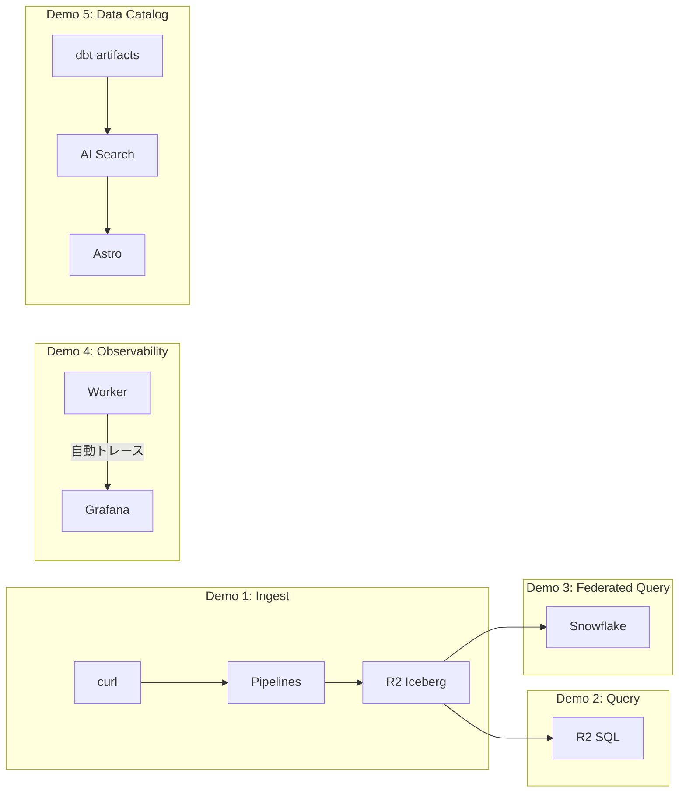
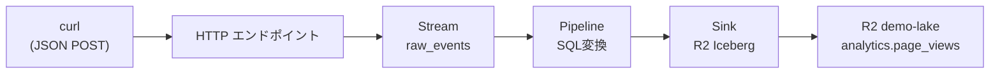
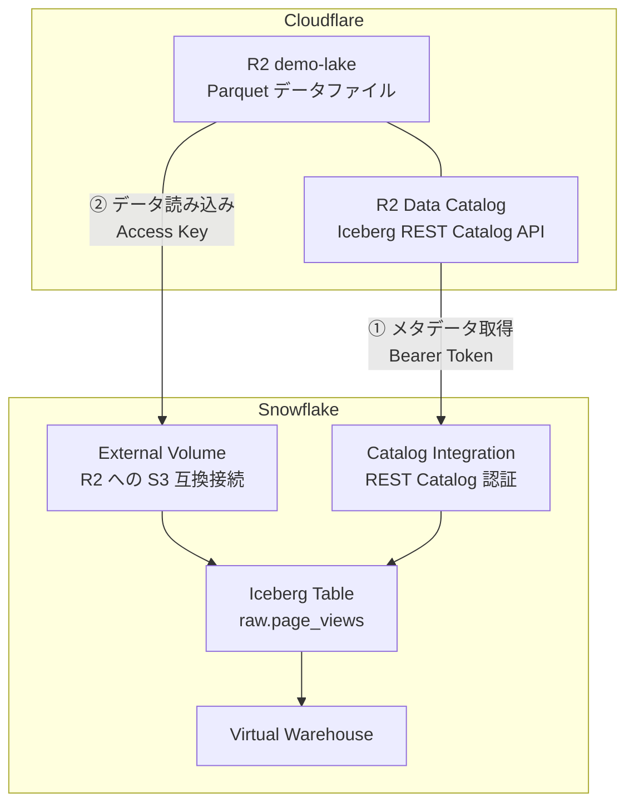
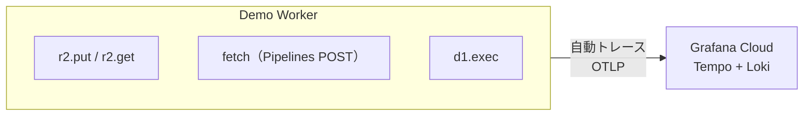
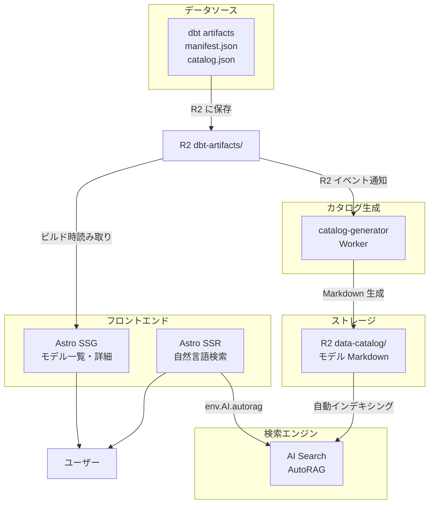

# Cloudflare Data Platform — デモ設計書

## コンセプト

全デモが **同じデータパイプライン** の異なる断面を見せる。
バラバラのデモではなく「データが流れて、貯まって、見えて、使える」一本のストーリー。



## 共通の前提リソース

| リソース | 用途 | 備考 |
|---------|------|------|
| R2 バケット `demo-lake` | 全デモのストレージ | Data Catalog 有効化済み |
| namespace `analytics` | Iceberg テーブルの格納先 | |
| API トークン | R2 + Data Catalog + R2 SQL の Read/Write | 1トークンに統合 |
| Cloudflare アカウント | Workers Paid プラン | Pipelines Beta 利用 |

### 前提セットアップ

```bash
# R2 バケット作成 & Data Catalog 有効化
wrangler r2 bucket create demo-lake
wrangler r2 bucket catalog enable demo-lake

# ウェアハウス名を控えておく（R2 SQL / Snowflake で使う）
wrangler r2 bucket catalog get demo-lake
# → Warehouse name: xxxxxxx_data-catalog
# → Catalog URI: https://<ACCOUNT_ID>.r2-data-catalog.cloudflare.com
```

---

## Demo 1: Pipelines ライブインジェスト

**スライド対応**: `05-ingest.md`
**メッセージ**: curl 1発でデータが Iceberg テーブルに自動変換される

### アーキテクチャ



### セットアップ

#### 1. Stream の作成（Structured）

```bash
wrangler pipelines streams create raw_events --schema-file schema.json --http-enabled true
```

**schema.json**:

```json
{
  "fields": [
    { "name": "event_id", "type": "string", "required": true },
    { "name": "user_id", "type": "string", "required": true },
    { "name": "event_type", "type": "string", "required": true },
    { "name": "url", "type": "string", "required": false },
    { "name": "user_agent", "type": "string", "required": false },
    { "name": "country", "type": "string", "required": false },
    { "name": "timestamp", "type": "timestamp", "required": true }
  ]
}
```

#### 2. Sink の作成

```bash
wrangler pipelines sinks create events_sink \
  --type r2-data-catalog \
  --bucket demo-lake \
  --namespace analytics \
  --table page_views \
  --compression zstd \
  --roll-interval 60
```

#### 3. Pipeline の作成（SQL変換付き）

```bash
wrangler pipelines create events_pipeline \
  --sql "INSERT INTO events_sink
SELECT
  event_id,
  user_id,
  lower(event_type) AS event_type,
  regexp_match(url, '^https?://([^/]+)')[1] AS domain,
  country,
  timestamp AS event_time
FROM raw_events
WHERE event_type != 'debug'
  AND NOT regexp_like(user_agent, '(?i)bot|spider')"
```

### デモ本番の操作

```bash
# イベントを POST
curl -X POST https://{STREAM_ID}.pipelines.cloudflare.com/ \
  -H "Content-Type: application/json" \
  -d '[
    {"event_id":"e001","user_id":"u42","event_type":"page_view","url":"https://example.com/products","user_agent":"Mozilla/5.0","country":"JP","timestamp":"2026-04-03T10:00:00Z"},
    {"event_id":"e002","user_id":"u13","event_type":"click","url":"https://example.com/cart","user_agent":"Mozilla/5.0","country":"US","timestamp":"2026-04-03T10:00:01Z"},
    {"event_id":"e003","user_id":"u42","event_type":"page_view","url":"https://blog.example.com/post-1","user_agent":"Googlebot","country":"JP","timestamp":"2026-04-03T10:00:02Z"}
  ]'
```

**見せるポイント**:
- 3件送ったうち Googlebot の1件が SQL の WHERE で除外される
- `url` から `domain` が自動抽出される
- `event_type` が小文字に正規化される
- R2 にPaquet ファイルが生成される（ダッシュボードで確認）

### 確認コマンド

```bash
# R2 の中身を確認（Parquet ファイルが生えている）
wrangler r2 object list demo-lake --prefix warehouse/analytics/page_views/

# テーブルの存在確認
wrangler r2 sql query "<warehouse>" "SHOW TABLES IN analytics"
```

---

## Demo 2: R2 SQL で即時クエリ

**スライド対応**: `03-storage.md`
**メッセージ**: 貯めたデータを外部ツールなしでその場で探索できる

### デモ本番の操作

```bash
# テーブル構造の確認
wrangler r2 sql query "<warehouse>" "DESCRIBE analytics.page_views"

# 基本クエリ
wrangler r2 sql query "<warehouse>" \
  "SELECT domain, count(*) as views
   FROM analytics.page_views
   GROUP BY domain
   ORDER BY views DESC"

# 国別ユニークユーザー
wrangler r2 sql query "<warehouse>" \
  "SELECT country, count(DISTINCT user_id) as unique_users
   FROM analytics.page_views
   GROUP BY country"

# EXPLAIN で実行計画を見せる
wrangler r2 sql query "<warehouse>" \
  "EXPLAIN SELECT domain, count(*) FROM analytics.page_views GROUP BY domain"
```

**見せるポイント**:
- Demo 1 で入れたデータがすぐクエリできる
- GROUP BY + 集約関数が動く
- EXPLAIN で DataFusion の実行計画が見える
- 「Snowflake/BigQuery なしで探索はこれで十分」

### 制限の実演（オプション）

```bash
# JOIN を試みてエラーを見せる → Snowflake デモへの導線
wrangler r2 sql query "<warehouse>" \
  "SELECT * FROM analytics.page_views a JOIN analytics.users b ON a.user_id = b.id"
# → Error: unsupported feature: JOIN operations are not supported
```

「JOIN が必要なら？ → Snowflake に繋げばいい。データはそのまま R2 に。」

---

## Demo 3: Snowflake → R2 Iceberg クエリ

**スライド対応**: `03-storage.md` + `11-summary.md`（ベンダーロックインなし）
**メッセージ**: 同じデータを Snowflake のフル SQL で。エグレス $0。

### アーキテクチャ



### 認証の準備

2つの認証経路が必要:

| 認証先 | 方式 | Snowflake 側 | Cloudflare 側 |
|-------|------|-------------|--------------|
| R2 Data Catalog API | Bearer Token | CATALOG INTEGRATION | API Token（Data Catalog Read） |
| R2 バケット（S3互換） | Access Key / Secret Key | EXTERNAL VOLUME | API Token（R2 Storage Read） |

Cloudflare ダッシュボード → My Profile → API Tokens → Create Token:

```
権限:
  - Workers R2 Data Catalog Read
  - Workers R2 Storage Bucket Item Read
リソース: demo-lake バケットに限定
```

### セットアップ SQL（Snowflake）

```sql
-- Step 1: External Volume（R2 への S3 互換接続）
CREATE OR REPLACE EXTERNAL VOLUME ext_vol_r2
    STORAGE_LOCATIONS = (
        (
            NAME = 'r2_storage'
            STORAGE_PROVIDER = 'S3COMPAT'
            STORAGE_BASE_URL = 's3compat://demo-lake'
            CREDENTIALS = (
                AWS_KEY_ID = '<R2_ACCESS_KEY_ID>'
                AWS_SECRET_KEY = '<R2_SECRET_ACCESS_KEY>'
            )
            STORAGE_ENDPOINT = '<ACCOUNT_ID>.r2.cloudflarestorage.com'
        )
    )
    ALLOW_WRITES = FALSE;

-- Step 2: Catalog Integration（REST Catalog 認証）
CREATE OR REPLACE CATALOG INTEGRATION r2_data_catalog
    CATALOG_SOURCE = ICEBERG_REST
    TABLE_FORMAT = ICEBERG
    CATALOG_NAMESPACE = 'analytics'
    REST_CONFIG = (
        CATALOG_URI = 'https://<ACCOUNT_ID>.r2-data-catalog.cloudflare.com'
        CATALOG_NAME = '<WAREHOUSE_NAME>'
    )
    REST_AUTHENTICATION = (
        TYPE = BEARER
        BEARER_TOKEN = '<CLOUDFLARE_API_TOKEN>'
    )
    ENABLED = TRUE;

-- Step 3: Iceberg Table 作成
CREATE DATABASE IF NOT EXISTS r2_lakehouse;
USE DATABASE r2_lakehouse;
CREATE SCHEMA IF NOT EXISTS raw;

CREATE ICEBERG TABLE raw.page_views
    CATALOG = 'r2_data_catalog'
    EXTERNAL_VOLUME = 'ext_vol_r2'
    CATALOG_TABLE_NAME = 'page_views';
```

### デモ本番の操作（Snowflake Worksheet）

```sql
-- Demo 1 で入れたデータが Snowflake から見える
SELECT * FROM r2_lakehouse.raw.page_views LIMIT 10;

-- R2 SQL では使えない集計を Snowflake で実行
SELECT
    DATE_TRUNC('hour', event_time) AS hour,
    country,
    COUNT(*) AS event_count,
    COUNT(DISTINCT user_id) AS unique_users
FROM r2_lakehouse.raw.page_views
WHERE event_time >= DATEADD('day', -7, CURRENT_TIMESTAMP())
GROUP BY 1, 2
ORDER BY 1 DESC, 3 DESC;

-- R2 SQL では使えない JOIN を実演
-- (別テーブル users を事前に用意しておく)
SELECT
    p.domain,
    u.plan_type,
    COUNT(*) AS views
FROM r2_lakehouse.raw.page_views p
JOIN r2_lakehouse.raw.users u ON p.user_id = u.user_id
GROUP BY 1, 2
ORDER BY 3 DESC;

-- WINDOW 関数も動く
SELECT
    user_id,
    event_time,
    ROW_NUMBER() OVER (PARTITION BY user_id ORDER BY event_time) AS visit_number
FROM r2_lakehouse.raw.page_views;
```

**見せるポイント**:
- Demo 1-2 と **全く同じデータ** を Snowflake から読んでいる
- JOIN / WINDOW が使える = R2 SQL の制限を Snowflake で補完
- R2 のエグレスは $0 なので読み取りコストはゼロ
- 「データは R2 に、計算は好きなエンジンで」

### JOIN デモ用の users テーブル準備

Pipelines で別テーブルを作るか、PyIceberg で直接書き込む:

```python
# PyIceberg で users テーブルを作成
from pyiceberg.catalog.rest import RestCatalog
import pyarrow as pa

catalog = RestCatalog(
    name="r2",
    uri="https://<ACCOUNT_ID>.r2-data-catalog.cloudflare.com",
    warehouse="<WAREHOUSE_NAME>",
    token="<API_TOKEN>",
)

schema = pa.schema([
    ("user_id", pa.string()),
    ("name", pa.string()),
    ("plan_type", pa.string()),
    ("signup_date", pa.date32()),
])

users_data = pa.table({
    "user_id": ["u42", "u13", "u07", "u99"],
    "name": ["Alice", "Bob", "Charlie", "Diana"],
    "plan_type": ["pro", "free", "enterprise", "pro"],
    "signup_date": ["2025-01-15", "2025-03-20", "2024-11-01", "2026-01-10"],
})

catalog.create_namespace_if_not_exists("analytics")
table = catalog.create_table("analytics.users", schema=schema)
table.append(users_data)
```

---

## Demo 4: OpenTelemetry → Grafana トレース

**スライド対応**: `09-observability.md`
**メッセージ**: コード変更ゼロで Worker の全操作が可視化される

### アーキテクチャ



### 方針

**追加の Worker を作らない**。Demo 1 の Pipelines にデータを POST する Worker を1つ作り、その Worker のトレースを Grafana で見せる。

```
Demo Worker:
  1. R2 からマスタデータを読み取り (r2.get)
  2. データを加工
  3. Pipelines HTTP エンドポイントに POST (fetch)
  4. 結果を D1 に書き込み (d1.exec)
```

これで r2 / fetch / d1 の3種類のスパンが1つのトレースに含まれる。

### Grafana Cloud セットアップ

1. Grafana Cloud 無料アカウント作成
2. **Connections → Add new connection → OpenTelemetry (OTLP)** → トークン作成
3. エンドポイントとトークンを控える

### Cloudflare 側の設定

Cloudflare ダッシュボード → Workers & Pages → Observability → Add destination:

```
# トレース用
Destination Name: grafana-traces
Destination Type: Traces
OTLP Endpoint:   https://otlp-gateway-prod-us-east-2.grafana.net/otlp/v1/traces
Custom Headers:   Authorization: Basic <GRAFANA_TOKEN>

# ログ用
Destination Name: grafana-logs
Destination Type: Logs
OTLP Endpoint:   https://otlp-gateway-prod-us-east-2.grafana.net/otlp/v1/logs
Custom Headers:   Authorization: Basic <GRAFANA_TOKEN>
```

### Demo Worker（wrangler.jsonc）

```jsonc
{
  "name": "demo-pipeline-worker",
  "main": "src/index.ts",
  "compatibility_date": "2026-03-01",
  "r2_buckets": [
    { "binding": "BUCKET", "bucket_name": "demo-lake" }
  ],
  "d1_databases": [
    { "binding": "DB", "database_name": "demo-db", "database_id": "<ID>" }
  ],
  "observability": {
    "traces": {
      "enabled": true,
      "head_sampling_rate": 1,
      "destinations": ["grafana-traces"]
    },
    "logs": {
      "enabled": true,
      "destinations": ["grafana-logs"]
    }
  },
  "triggers": {
    "crons": ["*/5 * * * *"]
  }
}
```

### Demo Worker（src/index.ts）

```typescript
export default {
  async scheduled(event: ScheduledEvent, env: Env, ctx: ExecutionContext) {
    // 1. R2 からマスタデータ読み取り → r2.get スパン
    const masterObj = await env.BUCKET.get("master/config.json");
    const config = masterObj ? await masterObj.json() : { version: 1 };

    // 2. Pipelines にイベント POST → fetch スパン
    const events = generateSampleEvents(5);
    await fetch("https://{STREAM_ID}.pipelines.cloudflare.com/", {
      method: "POST",
      headers: { "Content-Type": "application/json" },
      body: JSON.stringify(events),
    });

    // 3. D1 に実行ログ書き込み → d1.exec スパン
    await env.DB.prepare(
      "INSERT INTO pipeline_runs (run_at, event_count, status) VALUES (?, ?, ?)"
    ).bind(new Date().toISOString(), events.length, "success").run();

    console.log(`Pipeline run: ${events.length} events sent`);
  },
};

function generateSampleEvents(count: number) {
  const types = ["page_view", "click", "scroll", "purchase"];
  const countries = ["JP", "US", "DE", "BR"];
  const domains = ["example.com", "blog.example.com", "shop.example.com"];
  return Array.from({ length: count }, (_, i) => ({
    event_id: `e-${Date.now()}-${i}`,
    user_id: `u${Math.floor(Math.random() * 100)}`,
    event_type: types[Math.floor(Math.random() * types.length)],
    url: `https://${domains[Math.floor(Math.random() * domains.length)]}/page-${i}`,
    user_agent: "Mozilla/5.0",
    country: countries[Math.floor(Math.random() * countries.length)],
    timestamp: new Date().toISOString(),
  }));
}
```

### D1 テーブル準備

```bash
wrangler d1 create demo-db
wrangler d1 execute demo-db --command \
  "CREATE TABLE IF NOT EXISTS pipeline_runs (
    id INTEGER PRIMARY KEY AUTOINCREMENT,
    run_at TEXT NOT NULL,
    event_count INTEGER NOT NULL,
    status TEXT NOT NULL
  )"
```

### デモ本番の操作

1. Demo Worker をデプロイ: `wrangler deploy`
2. 手動トリガーまたは Cron を待つ
3. **Grafana Cloud → Explore → Tempo** を開く
4. 最新のトレースを選択

**見せるポイント（Grafana 画面）**:
- 1つのリクエスト内に `r2.get` → `fetch` → `d1.exec` のスパンが並ぶ
- 各スパンの実行時間・ステータスが見える
- **コードに計装用のライブラリを追加していない** ことを強調
- `observability.traces.enabled = true` だけで全部出る

### サンプリングの説明

```jsonc
// 本番では 5% にして Grafana のコストを抑える
"head_sampling_rate": 0.05
```

---

## Demo 5: Astro データカタログ × AI Search

**スライド対応**: `07-ai.md`（AI Search）+ `08-activation.md`
**メッセージ**: 「売上に関連するテーブルは？」で検索できるデータカタログ

### アーキテクチャ



### Phase 1: デモ用最小構成

目標: **「自然言語でテーブルを検索できる」をライブで見せる**

#### 1. R2 バケット作成（カタログコンテンツ用）

```bash
wrangler r2 bucket create data-catalog
```

#### 2. サンプル dbt artifacts → モデル Markdown 生成

manifest.json からモデル情報を抽出し、Markdown に変換する Worker。

**カタログ Markdown テンプレート**:

```markdown
# fct_sales

## 概要
日次の売上ファクトテーブル。注文確定時点の税抜き金額を記録。

## テーブル情報
- **スキーマ**: marts
- **マテリアライゼーション**: table
- **更新頻度**: 日次（毎朝 06:00 UTC）
- **データソース**: stg_orders → fct_sales

## カラム

| カラム名 | 型 | 説明 |
|---------|------|------|
| order_id | STRING | 注文ID（PK） |
| order_date | DATE | 注文日 |
| customer_id | STRING | 顧客ID（FK → dim_customers） |
| product_id | STRING | 商品ID（FK → dim_products） |
| amount | DECIMAL | 税抜き注文金額 |
| quantity | INTEGER | 注文数量 |
| status | STRING | 注文ステータス（confirmed / refunded） |

## 使用例

SELECT DATE_TRUNC('month', order_date) AS month, SUM(amount) AS revenue
FROM marts.fct_sales WHERE status = 'confirmed' GROUP BY 1

## 関連
- 上流: stg_orders
- メトリクス: revenue（売上 = SUM(amount) WHERE status = 'confirmed'）
```

デモ用にサンプルモデル 5-10 件分の Markdown を用意して R2 にアップロード:

```bash
# サンプルカタログを R2 に配置
wrangler r2 object put data-catalog/models/marts/fct_sales.md --file ./catalog/fct_sales.md
wrangler r2 object put data-catalog/models/marts/fct_daily_revenue.md --file ./catalog/fct_daily_revenue.md
wrangler r2 object put data-catalog/models/marts/dim_products.md --file ./catalog/dim_products.md
wrangler r2 object put data-catalog/models/marts/dim_customers.md --file ./catalog/dim_customers.md
wrangler r2 object put data-catalog/models/staging/stg_orders.md --file ./catalog/stg_orders.md
wrangler r2 object put data-catalog/models/staging/stg_customers.md --file ./catalog/stg_customers.md
```

#### 3. AI Search の設定

Cloudflare ダッシュボード → AI → AI Search で新規作成:

```
名前: data-catalog-search
データソース: R2 バケット `data-catalog`
モデル: @cf/meta/llama-3.1-8b-instruct（デフォルト）
```

設定後、R2 にアップロードした Markdown が自動でチャンク分割 → 埋め込み → Vectorize にインデックスされる。

#### 4. Astro アプリ

```bash
npm create cloudflare@latest -- data-catalog-app --framework=astro
cd data-catalog-app
```

**wrangler.jsonc**:

```jsonc
{
  "name": "data-catalog-app",
  "main": "dist/_worker.js",
  "compatibility_date": "2026-03-01",
  "ai": {
    "binding": "AI"
  },
  "r2_buckets": [
    { "binding": "ARTIFACTS", "bucket_name": "data-catalog" }
  ]
}
```

**検索ページ（src/pages/search.astro）**:

```astro
---
// SSR: サーバーサイドで AI Search を呼び出す
const query = Astro.url.searchParams.get("q") || "";
let results = null;

if (query) {
  const runtime = Astro.locals.runtime;
  const response = await runtime.env.AI.autorag("data-catalog-search").aiSearch({
    query,
  });
  results = response;
}
---

<html>
<body>
  <h1>データカタログ検索</h1>
  <form method="get">
    <input
      type="text"
      name="q"
      value={query}
      placeholder="例: 売上に関連するテーブルは？"
      style="width: 400px; padding: 8px;"
    />
    <button type="submit">検索</button>
  </form>

  {results && (
    <div>
      <h2>回答</h2>
      <p>{results.response}</p>

      <h2>参照元</h2>
      <ul>
        {results.data.map((source) => (
          <li>
            <strong>{source.filename}</strong>
            <p>{source.text}</p>
            <small>スコア: {source.score.toFixed(3)}</small>
          </li>
        ))}
      </ul>
    </div>
  )}
</body>
</html>
```

### デモ本番の操作

```
1. 検索バーに「売上に関連するテーブルは？」と入力
2. AI Search が fct_sales, fct_daily_revenue などを返す
3. 「顧客の属性を持つテーブルは？」と入力
4. dim_customers, stg_customers が返る
5. 「注文のステータスを確認するには？」と入力
6. fct_sales の status カラムの説明が返る
```

**見せるポイント**:
- キーワード一致ではなく **意味検索** で関連テーブルが見つかる
- dbt docs のキーワード検索との違い
- Markdown を R2 に置くだけで AI Search が自動インデキシング
- **追加インフラゼロ**（DataHub / Amundsen のような Java/K8s が不要）

### Phase 2 以降（スライドデモの範囲外）

- SSG でモデル一覧・詳細ページ
- リネージ可視化（manifest.json の `depends_on`）
- 用語集 MDX（Content Collections + Zod スキーマ）
- Cloudflare Access で認証
- OSI メトリクス定義
- 類似カラム検索（Vectorize 直接）
- dbt run_results からテスト結果・フレッシュネス表示

---

## 実施順序

```
Phase 0: 共通リソース準備
  └── R2 バケット, API トークン, namespace

Phase 1: Demo 1 + 2（基盤）
  ├── Pipelines セットアップ（Stream + Sink + Pipeline）
  ├── curl でデータ投入
  └── R2 SQL でクエリ確認

Phase 2: Demo 4（Observability）
  ├── Grafana Cloud アカウント + OTLP トークン
  ├── Cloudflare Observability に destination 追加
  ├── Demo Worker 作成・デプロイ
  └── Grafana でトレース確認

Phase 3: Demo 3（Snowflake）
  ├── Snowflake に External Volume 作成
  ├── Catalog Integration 作成
  ├── Iceberg Table 作成
  ├── PyIceberg で users テーブル準備（JOIN 用）
  └── Snowflake Worksheet でクエリ確認

Phase 4: Demo 5（データカタログ）
  ├── サンプル Markdown 作成 → R2 にアップロード
  ├── AI Search 設定
  ├── Astro アプリ作成
  └── 検索デモ確認
```

## タイムライン（発表時）

| 時間 | デモ | 操作 |
|------|------|------|
| 0:00 | Demo 1 | curl でイベント POST → R2 に Parquet 確認 |
| 2:00 | Demo 2 | R2 SQL でクエリ → JOIN エラーを見せる |
| 3:30 | Demo 3 | Snowflake Worksheet で同じデータを JOIN 付きクエリ |
| 5:30 | Demo 4 | Grafana で Worker のトレースを表示 |
| 7:00 | Demo 5 | データカタログで自然言語検索 |
| 9:00 | 終了 | |
