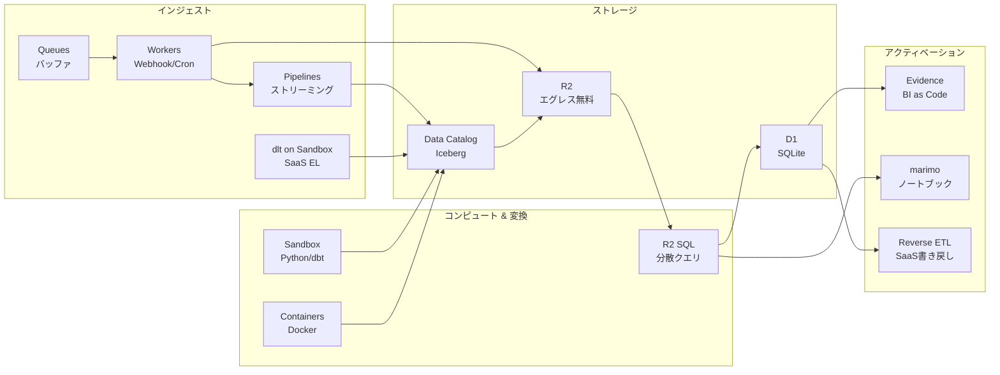

# Data Platform の全体像

---

# Cloudflare Data Platform とは

2025年9月発表。**Pipelines + R2 Data Catalog + R2 SQL** の3コンポーネント。

### Pipelines
ストリーミングインジェスト

HTTP / Binding → Iceberg 自動書き込み

### R2 Data Catalog
Iceberg カタログ

REST Catalog API でどのエンジンからも接続

### R2 SQL
分散クエリエンジン

DataFusion ベース、エッジで分析完結

エグレス料金ゼロ + Apache Iceberg 標準 = ベンダーロックインなし

---

# アーキテクチャ概観

