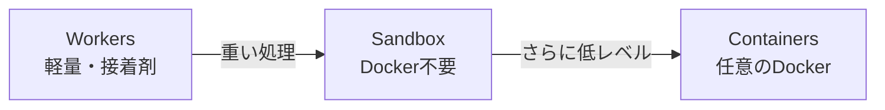

# コンピューティング

---

# 3層のコンピュートモデル

| | Workers | Sandbox | Containers |
|---|---|---|---|
| **実行時間** | CPU 最大 30秒 | 制限なし | 制限なし |
| **メモリ** | 128 MB | Containers準拠 | 最大 12 GiB |
| **言語** | JS/TS/WASM | Python/Node/Shell | Docker なら何でも |
| **コールドスタート** | 0ms | 秒単位 | 秒単位 |
| **実行場所** | エッジ（330+都市） | リージョナル | リージョナル |

<v-click>



</v-click>

<v-click>

**設計原則**: 全部 Containers にするのではなく「Workers が重い処理を委譲する」

</v-click>

---

# Workers の Binding — サービスが変数になる

```ts
// Lambda: SDK初期化 + IAM認証 + HTTPリクエスト
const s3 = new S3Client({ region: "us-east-1" });
await s3.send(new PutObjectCommand({
  Bucket: "my-bucket", Key: "file.json", Body: data
}));

// Workers: Binding で直接アクセス（env にサービスが注入済み）
await env.BUCKET.put("file.json", data);
```

<v-click>

| | Lambda + S3 | Workers + R2 |
|---|---|---|
| **アクセス制御** | IAM ポリシーで「誰が何をしていいか」定義 | Binding がなければ触る能力自体がない |
| **コード量** | SDK + 認証 + エラーハンドリング | 1行 |
| **コールドスタート** | SDK ロード + TLS ハンドシェイク | オーバーヘッドなし |
| **設定ミスのリスク** | IAM の過剰な権限付与 | `wrangler.jsonc` に書かなければアクセス不可 |

</v-click>

<v-click>

**Binding の本質**: 環境変数に接続文字列ではなく **認証済みのサービス参照** が入っている

</v-click>

---

# セキュリティモデルの比較 — トレードオフは逆方向

| | AWS（IAM） | Cloudflare（Binding） |
|---|---|---|
| **設計思想** | 細かく制御できる | 間違えにくい |
| **リスクの方向** | 広すぎるアクセスを与えがち | リソース単位の粗い制御しかできない |
| **典型的な事故** | `s3:*` + `Resource: *` で全バケット公開 | Worker のコード脆弱性経由でバケット全体にアクセス |

<v-clicks>

- **AWS**: ポリシーが複雑 → 設定ミス → 意図しないアクセスが通る
- **Cloudflare**: Binding = バケット全体。プレフィックス制限や行レベル制御ができない
- **どちらが安全か？** → 問いが違う。AWS は「運用の規律」、Cloudflare は「コードの品質」に安全性が依存する

</v-clicks>
