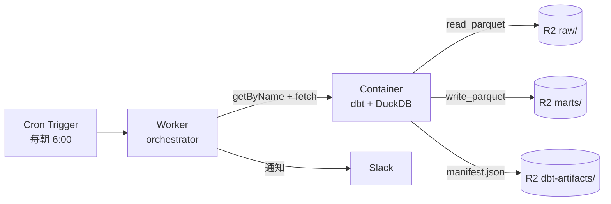

# dbt を Cloudflare 環境で動かす

<!--
データ変換のデファクト dbt を、外部 DWH や dbt Cloud 無しで Cloudflare 一社で
回す構成。Workers では動かないので Containers が必要、という前提から始めて、
GitHub Actions と比べた Cloudflare 完結の強みを 4 枚で見せる。
-->

---

# dbt を Cloudflare で動かす

dbt は Python の CLI ツール。**Workers / Python Workers では subprocess も DuckDB native binary も足りない**ので、**Containers で動かす**。Sandbox でも動かせる。

<div class="grid grid-cols-2 gap-4 mt-4 text-sm">

<div class="border border-zinc-500/30 rounded p-3">

### Workers では厳しい

- Pyodide ベースで `subprocess` 不可
- DuckDB の native binary が無い
- メモリ 128 MB の壁
- ファイル書き込みも限定的

</div>

<div class="border border-orange-500/30 rounded p-3">

### Containers なら動く

- 任意の Docker image (Python フル)
- メモリ最大 12 GiB / CPU 制限なし
- Linux microVM (Firecracker)
- `sleepAfter` で idle 課金ゼロ

</div>

</div>

<div class="mt-4 border border-orange-500/30 rounded p-4 text-sm">

### わざわざ Cloudflare Containers で動かすメリット

- **アーティファクト保存**: **R2 に binding 経由でキー無し永続** (Outbound Workers)
- **dbt docs ホスティング**: **Workers Static Assets が R2 をプロキシ配信** + Cloudflare Access で社内限定
- **secrets / 設定の集約**: **Workers Secrets + binding** を `wrangler.jsonc` 1 つに

</div>

<!--
dbt は Python の CLI ツールなので、Workers / Python Workers では動かない。
subprocess が呼べない、DuckDB のような native binary が Pyodide にない、
メモリ 128 MB の壁。これらを全部解決するのが Containers。
任意の Docker image を持ち込めて、メモリ最大 12 GiB、CPU 制限なし、
Linux microVM 上で実行され、sleepAfter で idle なら課金ゼロ。
ちなみに Sandbox でも同じことができる。Sandbox は Containers を Worker から
扱いやすくした高レベル API で、本筋は Containers で説明する。
GitHub Actions でも dbt は動かせるが、Containers だとアーティファクトを
R2 に binding 経由で保存できる点が大きい。manifest.json や dbt docs の
出力を Outbound Workers 経由でキー無しに R2 へ送れる。
さらに Workers Static Assets で R2 のオブジェクトをプロキシ配信し、
Cloudflare Access で社内限定の dbt docs サイトが 30 秒で組める。
GHA だと artifact は 90 日で消える、docs は別途 Pages 設定が必要、
secrets も別管理、というところを Cloudflare 完結なら wrangler.jsonc 1 つに
集約できる。
-->

---

# アーキテクチャ — Cron → Worker → Container → R2



- **Worker は薄いオーケストレーター**: Cron で起動、Container を起こして結果を Slack 通知
- **Container が dbt 実行本体**: Dockerfile に dbt project と `uv.lock` を焼き込んで `uv run dbt build`
- **R2 が永続層**: 入力 Parquet も出力 marts もすべて R2、エグレス $0

```typescript
// src/worker.ts
const c = env.DBT_CONTAINER.getByName(`dbt-${runId}`);
const res = await c.fetch("https://internal/run", { method: "POST" });
const { exitCode, stdout } = await res.json();
if (exitCode !== 0) await notifySlack(env, stdout);
```

<!--
全体像はこの 1 枚で説明できる。Cron Trigger が毎朝 Worker を叩いて、
Worker が DBT_CONTAINER binding 経由で Container にリクエスト。
Container は Dockerfile で uv sync 済み、起動時に FastAPI などの HTTP
server が立ち、/run に POST が来たら subprocess で uv run dbt build を
走らせる。入力データは R2 raw/ から read_parquet で読んで、出力 marts/
も Parquet で R2 に書き戻す。Outbound Workers を使えば Container 内の
コードから R2 へ API キー無しでアクセスできる。sleepAfter で idle なら
課金ゼロ。
なお dbt 本体は Workers でも Python Workers でも動かない。subprocess 不可、
DuckDB のような native binary が Pyodide にない、メモリ 128 MB の壁、の
3 点が壁になるので、Linux microVM が立つ Containers が必要、というのが
構成上の判断。
従来の Airflow + EC2 構成と比べると Wrangler deploy 1 発で完結し、
月額 1〜5 ドル。
-->

---

# 嬉しさは「全部 Cloudflare で閉じる」こと

<div class="grid grid-cols-3 gap-4 mt-6">

<div class="border border-orange-500/30 rounded p-4">

### 💰 コスト

`$100+/月` のマネージド dbt SaaS → **`$5/月`** の Workers Paid + Containers

R2 → 外部 DWH のエグレス **$0** (Iceberg REST 経由)

</div>

<div class="border border-orange-500/30 rounded p-4">

### 📚 dbt docs を Zero Trust で配信

```bash
uv run dbt docs generate
cd target && wrangler deploy
```

→ Workers Static Assets + **Cloudflare Access** で社内限定の dbt ドキュメントサイト完成

</div>

<div class="border border-orange-500/30 rounded p-4">

### 🔍 Correlated Logs

`Worker → DO → Container` の dbt run トレースが **1 画面**で時系列表示

エージェント駆動 dbt の監査基盤

</div>

</div>

<div class="mt-6 text-sm op-80">

**全振りでなくてもいい**: 重い集約は Snowflake、軽い下流 mart は Containers + dbt-duckdb の **ハイブリッド構成** も現実解。R2 を共通基盤に dbt を 2 系統並走できる。

</div>

<!--
嬉しいのはコストだけじゃない。マネージド SaaS の 100 ドル超えが 5 ドルになるのも大きいが、
本当の価値は単一プロバイダで全部閉じることにある。dbt docs の社内配信は地味だが
他社サービスでは一番不自由する部分。Cloudflare なら wrangler deploy 1 発 + Access で
30 秒で組める。さらに 2026-04-21 に出たばかりの Correlated Logs で、
Worker / DO / Container のログが 1 画面で時系列表示される。エージェントが
dbt モデルを自動生成する時代の監査基盤として強い。なお、外部 DWH を捨てる必要は
なくて、重い集約は Snowflake、軽い下流マートは Containers というハイブリッド構成が現実的。
-->
