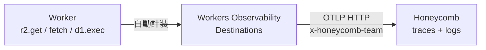

# Observability

<!--
データ基盤を運用する以上、Worker の中で何が起きているか見えないと困る。
Cloudflare の Workers Observability は OpenTelemetry 互換で、コード変更ゼロで
全操作のスパンが取れる。それを OTLP で Honeycomb に直送する 2 枚で見せる。
-->

---

# Workers Observability

全ての操作に**自動でスパンが生成**（OpenTelemetry 互換）。

- R2 読み書き・D1 クエリ・外部 fetch・Queue 送信・AI 推論を**自動計装**
- コードに手を加えず、パイプラインのボトルネックを可視化
- `observability.traces.enabled = true` の **1 行だけで有効化**

<div>

```jsonc
// wrangler.jsonc
{
  "observability": {
    "traces": { "enabled": true, "head_sampling_rate": 0.05 },
    "logs":   { "enabled": true }
  }
}
```

</div>

<!--
Workers Observability は Cloudflare 純正のテレメトリ基盤。
R2 / D1 / fetch / Queue / Workers AI など、Worker 内の主要な操作が
全部自動でスパン化される。AWS X-Ray のように SDK を入れたり計装コードを
書いたりは不要。wrangler.jsonc に enabled: true を書くだけ。
本番では head_sampling_rate: 0.05 で 5% に絞ってコストを抑えつつ
代表的なトレースが取れる、という運用がベース。
-->

---

# なぜ外部 OTLP バックエンドへ流すのか

Workers Observability は **取れる**ところまで素晴らしい。が、**取った後の運用** (見る / 気づく / 追える) は専用バックエンドに任せる方が OTel ピュアな現代的設計。

<div class="grid grid-cols-2 gap-4 mt-4 text-sm">

<div class="border border-zinc-500/30 rounded p-3">

### Workers Observability で取れる

- 自動計装 (R2 / D1 / fetch / AI のスパン全部)
- `enabled: true` 1 行で有効化
- 構造化クエリで検索
- Workers Paid 込み (10M events / 月)

</div>

<div class="border border-orange-500/30 rounded p-3">

### 運用バックエンドに欲しいもの

- **保持期間** — Logs **7 日** vs 専用バックエンドは **60 日〜数年**
- **異常因子の自動発見** — high-cardinality 属性 (`user_id` / `tenant` / `release`) でドリルダウン
- **SLO + Burn Alerts** — エラーバジェット消費レートで早期警告
- **on-call 連携** — エスカレーション / 電話 / Status Page

</div>

</div>

<div class="mt-4 border border-orange-500/30 rounded p-3 text-sm">

**OTel 標準だから分業できる** — `destinations: [...]` を 1 行足すだけ。**いつでも他のバックエンドに乗り換えられる** = ベンダーロックインを **構造で回避**

</div>

<!--
取れるかどうかと、取った後どう運用するかは別の問題。
Workers Observability は計装と収集の苦労を消してくれる素晴らしい仕組みで、
1 行で全操作のスパンが取れる。ただ運用の現場では別の機能が欲しくなる。
保持期間が 7 日固定なので、規制要件のある業界や、先月の挙動を再現したい
ケースで詰まる。それから高カーディナリティ分析、つまり user_id や tenant の
ような無数の値を持つ属性で異常因子を自動発見する機能。
SLO とバーンアラートでエラーバジェットの消費レートを監視する機能。
さらに on-call ツールとの統合で、夜中の電話エスカレーションまで繋ぐ機能。
これらは OTel 標準で外部に流す前提で作られているので、Workers Observability
に全部内蔵するより、分業した方が機能が深く育つという業界構造。
OTel ピュアなので、destinations を 1 行足すだけで、いつでも他のバックエンドに
乗り換えられる、という安心感もある。Cloudflare 完結と中立性の両立、
という難しい論点への構造的な答え。
-->

---

# OTLP で Honeycomb へ送る

Workers Observability は **OTLP HTTP** で外部バックエンドにそのまま送れる。



- **Honeycomb** は OpenTelemetry リファレンスバックエンド（"observability" の伝道元）
- Cloudflare Workers Observability の **Day 1 サポート対象**（Grafana / Honeycomb / Sentry / Axiom）
- destination は API キー 1 個で完結（`x-honeycomb-team` ヘッダ）
- dataset は OTLP の `service.name` 属性で**自動分離**（追加ヘッダ不要）

<div class="text-sm op-80 mt-3">

```
OTLP Endpoint: https://api.honeycomb.io/v1/traces
Custom Header: x-honeycomb-team: <HONEYCOMB_API_KEY>
```

</div>

<!--
自動取得したスパンとログは、OTLP HTTP で外部のバックエンドにそのまま送れる。
今回は Honeycomb を選んだ。Honeycomb は OpenTelemetry プロジェクトの主要貢献者で
"observability" 概念の伝道元、OTel-native の設計が一番自然に刺さる。
Cloudflare 公式の Day 1 サポート対象なのでドキュメントも揃っている。
設定は API キー 1 個を x-honeycomb-team ヘッダに入れるだけ。
dataset (Honeycomb 内の論理区切り) は OTLP の service.name で自動分離されるので、
他の宛先（Axiom は X-Axiom-Dataset 必須、Grafana は Basic 認証）と比べて最も簡素。
Worker 1 行 → OTLP → Honeycomb 1 行で完結する。
-->
