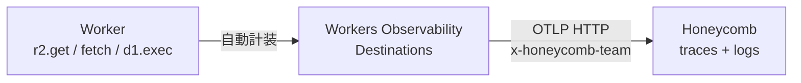

# Observability

<!--
データ基盤を運用する以上、Worker の中で何が起きているか見えないと困る。
Cloudflare の Workers Observability は OpenTelemetry 互換で、コード変更ゼロで
全操作のスパンが取れる。それを OTLP で Honeycomb に直送する 2 枚で見せる。
-->

---

# Workers Observability

全ての操作に**自動でスパンが生成**（OpenTelemetry 互換）。

<v-clicks>

- R2 読み書き・D1 クエリ・外部 fetch・Queue 送信・AI 推論を**自動計装**
- コードに手を加えず、パイプラインのボトルネックを可視化
- `observability.traces.enabled = true` の **1 行だけで有効化**

</v-clicks>

<div v-click>

```jsonc
// wrangler.jsonc
{
  "observability": {
    "traces": { "enabled": true, "head_sampling_rate": 0.05 },
    "logs":   { "enabled": true }
  }
}
```

</div>

<!--
Workers Observability は Cloudflare 純正のテレメトリ基盤。
R2 / D1 / fetch / Queue / Workers AI など、Worker 内の主要な操作が
全部自動でスパン化される。AWS X-Ray のように SDK を入れたり計装コードを
書いたりは不要。wrangler.jsonc に enabled: true を書くだけ。
本番では head_sampling_rate: 0.05 で 5% に絞ってコストを抑えつつ
代表的なトレースが取れる、という運用がベース。
-->

---

# OTLP で Honeycomb へ送る

Workers Observability は **OTLP HTTP** で外部バックエンドにそのまま送れる。



<v-clicks>

- **Honeycomb** は OpenTelemetry リファレンスバックエンド（"observability" の伝道元）
- Cloudflare Workers Observability の **Day 1 サポート対象**（Grafana / Honeycomb / Sentry / Axiom）
- destination は API キー 1 個で完結（`x-honeycomb-team` ヘッダ）
- dataset は OTLP の `service.name` 属性で**自動分離**（追加ヘッダ不要）

</v-clicks>

<div v-click class="text-sm op-80 mt-3">

```
OTLP Endpoint: https://api.honeycomb.io/v1/traces
Custom Header: x-honeycomb-team: <HONEYCOMB_API_KEY>
```

</div>

<!--
自動取得したスパンとログは、OTLP HTTP で外部のバックエンドにそのまま送れる。
今回は Honeycomb を選んだ。Honeycomb は OpenTelemetry プロジェクトの主要貢献者で
"observability" 概念の伝道元、OTel-native の設計が一番自然に刺さる。
Cloudflare 公式の Day 1 サポート対象なのでドキュメントも揃っている。
設定は API キー 1 個を x-honeycomb-team ヘッダに入れるだけ。
dataset (Honeycomb 内の論理区切り) は OTLP の service.name で自動分離されるので、
他の宛先（Axiom は X-Axiom-Dataset 必須、Grafana は Basic 認証）と比べて最も簡素。
Worker 1 行 → OTLP → Honeycomb 1 行で完結する。
-->
