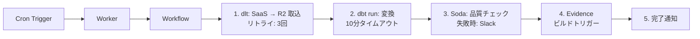

# オーケストレーション

---

# Workflows — サーバーレス耐久実行エンジン

Temporal / Step Functions に相当。TypeScript でコードとして定義。

<v-clicks>

- **`step.do()`** — 処理ステップ定義。戻り値は自動永続化
- **`step.sleep()`** — 待機（最大365日）
- **`step.waitForEvent()`** — 外部イベント待機（人間の承認フロー）
- **クラッシュ耐性** — 途中から再開（Durable Objects が状態保持）

</v-clicks>

**vs Step Functions**: Step Functions は ASL（JSON）でフロー定義。Workflows は TypeScript でロジックとフローが一体。Step Functions の方がビジュアルエディタ・実行履歴UIが成熟。Workflows はコードファーストで軽量だが、GUI での可視化は弱い。

