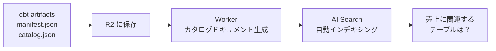

# AI

---

# AI スタック — データ基盤との統合

### Workers AI
<v-clicks>

- 多数のモデルをサーバーレス推論
- 埋め込みベクトル生成（RAG パイプライン）
- テキスト分類・感情分析
- Text-to-SQL

</v-clicks>

### Vectorize
<v-clicks>

- ベクトル DB（ANN 検索）
- データカタログ AI 検索
- ドキュメント Q&A

</v-clicks>

### AI Gateway
<v-clicks>

- AI API コールのプロキシ
- キャッシュ・レート制限・ロギング
- フォールバックルーティング

</v-clicks>

### Agents
<v-clicks>

- Durable Objects ベースのステートフルエージェント
- 対話型 BI エージェント
- パイプライン障害の自動対応
- Sandbox 連携でコード実行

</v-clicks>

**vs Bedrock**: Bedrock はモデル選択肢（Claude, Llama, Titan 等）と fine-tuning が充実。Workers AI はモデル数・カスタマイズで劣るが、エッジ推論 + Binding 統合でレイテンシとDXが優位。AI Gateway は Bedrock にない機能（キャッシュ・フォールバック・レート制限）。

---

# AI Search（AutoRAG）

キーワード検索 + AI セマンティック検索のマネージド検索サービス。

<v-click>

**データカタログの検索エンジン**として活用:

</v-click>

<v-click>

</v-click>

| | AI Search（AutoRAG） | Vectorize 直接 |
|---|---|---|
| セットアップ | ドキュメント投入だけ | 自前実装 |
| カスタマイズ性 | 低 | 高 |
| 向いている用途 | 素早く始めたい | 高度にチューニング |

**vs Kendra / Bedrock Knowledge Bases**: AWS はナレッジベース構築に S3 + Bedrock + OpenSearch が必要。AI Search は R2 にファイルを置くだけで自動 RAG。ただしカスタマイズ性は Bedrock KB の方が高い。

