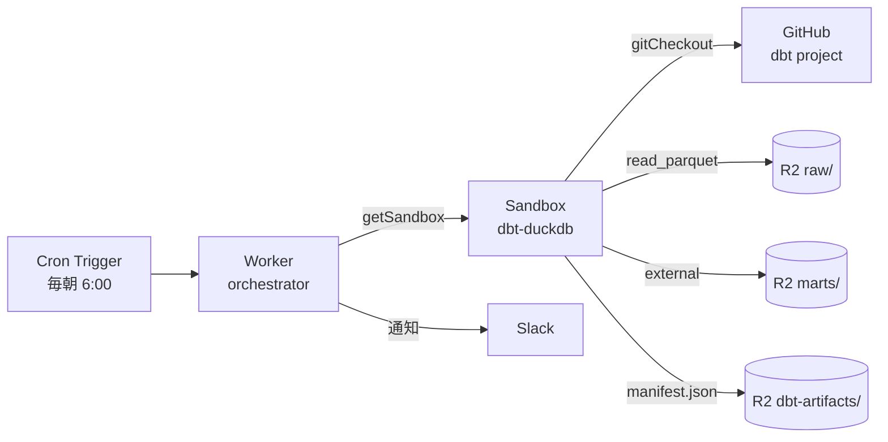
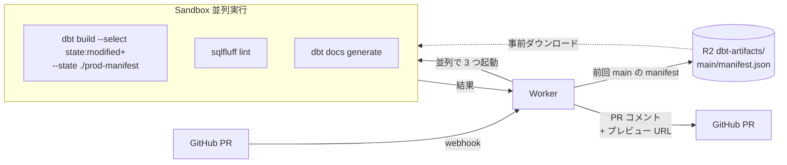

# dbt を Cloudflare 環境で動かす

<!--
データ変換のデファクト dbt を、外部 DWH や dbt Cloud 無しで Cloudflare 一社で
回す構成。Workers では動かないので Containers が必要、という前提から始めて、
GitHub Actions と比べた Cloudflare 完結の強みを 4 枚で見せる。
-->

---

# dbt を Cloudflare で動かす

dbt は Python の CLI ツール。**Workers / Python Workers では subprocess も DuckDB native binary も足りない**ので、**Containers が現実解**。

<div class="grid grid-cols-2 gap-4 mt-4 text-sm">

<div class="border border-zinc-500/30 rounded p-3">

### Workers では厳しい

- Pyodide ベースで `subprocess` 不可
- DuckDB の native binary が無い
- メモリ 128 MB の壁
- ファイル書き込みも限定的

</div>

<div class="border border-orange-500/30 rounded p-3">

### Containers なら動く

- 任意の Docker image (Python フル)
- メモリ最大 12 GiB / CPU 制限なし
- Linux microVM (Firecracker)
- `sleepAfter` で idle 課金ゼロ

</div>

</div>

<div class="mt-4 border border-orange-500/30 rounded p-4 text-sm">

### GitHub Actions と比べた Containers の強み

- **アーティファクト保存**: GHA Artifacts (90 日上限) → **R2 に binding 経由でキー無し永続** (Outbound Workers)
- **dbt docs ホスティング**: 別途 GitHub Pages 設定 → **Workers Static Assets が R2 をプロキシ配信** + Cloudflare Access で社内限定
- **secrets / 設定の集約**: GHA secrets → **Workers Secrets + binding** を `wrangler.jsonc` 1 つに

</div>

<!--
dbt は Python の CLI ツールなので、Workers / Python Workers では動かない。
subprocess が呼べない、DuckDB のような native binary が Pyodide にない、
メモリ 128 MB の壁。これらを全部解決するのが Containers。
任意の Docker image を持ち込めて、メモリ最大 12 GiB、CPU 制限なし、
Linux microVM 上で実行され、sleepAfter で idle なら課金ゼロ。
GitHub Actions でも dbt は動かせるが、Containers だとアーティファクトを
R2 に binding 経由で保存できる点が大きい。manifest.json や dbt docs の
出力を Outbound Workers 経由でキー無しに R2 へ送れる。
さらに Workers Static Assets で R2 のオブジェクトをプロキシ配信し、
Cloudflare Access で社内限定の dbt docs サイトが 30 秒で組める。
GHA だと artifact は 90 日で消える、docs は別途 Pages 設定が必要、
secrets も別管理、というところを Cloudflare 完結なら wrangler.jsonc 1 つに
集約できる。
-->

---

# アーキテクチャ — Cron → Worker → Sandbox → R2



- **Worker は薄いオーケストレーター**: Cron で起動、Sandbox を取り、結果を Slack 通知
- **Sandbox が dbt 実行本体**: `gitCheckout` で 1 行 clone、`dbt build` 1 行で完結
- **R2 が永続層**: 入力 Parquet も出力 marts もすべて R2、エグレス $0

```typescript
// src/worker.ts
const sandbox = getSandbox(env.Sandbox, `dbt-${runId}`);
await sandbox.gitCheckout(repo, { depth: 1, targetDir: "/w" });
const result = await sandbox.exec(
  "cd /w && pip install uv && uv sync --frozen && uv run dbt build",
  { timeout: 30 * 60 * 1000 }
);
```

<!--
全体像はこの 1 枚で説明できる。Cron Trigger が毎朝 Worker を叩いて、
Worker が Sandbox を立ち上げ、Sandbox の中で uv sync で uv.lock どおりに
依存を復元してから uv run dbt build。入力データは R2 の raw/ から read_parquet で読んで、
出力 marts/ も Parquet で R2 に書き戻す。Sandbox は実体は Durable Object + Firecracker
microVM なので、毎回真っさらの環境が立つ。コードは 10 行ちょっと。
なお dbt 本体は Workers でも Python Workers でも動かない。subprocess 不可、
DuckDB のような native binary が Pyodide にない、メモリ 128 MB の壁、の 3 点が
壁になる。Linux microVM が立つ Sandbox / Containers が必要、というのが
構成上の判断。
従来の Airflow + EC2 構成と比べると Wrangler deploy 1 発で完結し、月額 1〜5 ドル。
-->

---

# Slim CI — 変更したモデルだけ test

PR 単位で **全モデルを test するのは時間とコストの無駄**。前回 main の `manifest.json` と PR の差分を比較して、**変更箇所と下流だけ** を回す。



- **`state:modified+` セレクタ**: 変更モデル + その下流のみを対象 (dbt-core 標準)
- **前回 main の `manifest.json`** を R2 の `dbt-artifacts/main/` に保存しておく
- **Sandbox 3 並列**: test / lint / docs を `Promise.all` で同時実行 — 直列なら 6 分が 2 分に
- 結果を **PR にコメント + docs プレビュー URL** を貼る
- **`uv.lock`** を single source of truth に — CI Sandbox と本番 Container image が同じ lockfile を読み、依存ドリフトが構造的に発生しない

<!--
Slim CI は dbt の標準機能で、PR で変更したモデルだけを test する仕組み。
前回 main で生成した manifest.json と今回 PR の manifest を比較して、
変更ノードとその下流だけ走らせる。これは dbt-core の state:modified+ セレクタで
できる。前回 manifest を R2 の dbt-artifacts/main/ に毎日 build 後に保存しておけば、
Sandbox から事前ダウンロードして --state フラグに渡すだけ。
さらに Sandbox 3 並列で test/lint/docs を Promise.all すると、直列 6 分が 2 分に縮む。
GitHub Actions だとジョブ間データ受け渡しがファイル経由で面倒だが、
Sandbox なら変数で直接 — これが Cloudflare 完結の真価。
依存管理は uv.lock を single source of truth にしていて、CI Sandbox と
本番 Container image (将来切り出した場合) が同じ lockfile を読むので、
CI で通った PR が本番で落ちるというドリフト問題が構造的に発生しない。
uv は pip 比 10 倍以上速いので、Slim CI の各 Sandbox での依存解決も
数秒で済む。
-->

---

# 嬉しさは「全部 Cloudflare で閉じる」こと

<div class="grid grid-cols-3 gap-4 mt-6">

<div class="border border-orange-500/30 rounded p-4">

### 💰 コスト

`$100+/月` のマネージド dbt SaaS → **`$5/月`** の Workers Paid + Sandbox

R2 → 外部 DWH のエグレス **$0** (Iceberg REST 経由)

</div>

<div class="border border-orange-500/30 rounded p-4">

### 📚 dbt docs を Zero Trust で配信

```bash
uv run dbt docs generate
cd target && wrangler deploy
```

→ Workers Static Assets + **Cloudflare Access** で社内限定の dbt ドキュメントサイト完成

</div>

<div class="border border-orange-500/30 rounded p-4">

### 🔍 Correlated Logs

`Worker → DO → Container` の dbt run トレースが **1 画面**で時系列表示

エージェント駆動 dbt の監査基盤

</div>

</div>

<div class="mt-6 text-sm op-80">

**全振りでなくてもいい**: 重い集約は Snowflake、軽い下流 mart は Sandbox + dbt-duckdb の **ハイブリッド** も現実解。R2 を共通基盤に dbt を 2 系統並走できる。

</div>

<!--
嬉しいのはコストだけじゃない。マネージド SaaS の 100 ドル超えが 5 ドルになるのも大きいが、
本当の価値は単一プロバイダで全部閉じることにある。dbt docs の社内配信は地味だが
他社サービスでは一番不自由する部分。Cloudflare なら wrangler deploy 1 発 + Access で
30 秒で組める。さらに 2026-04-21 に出たばかりの Correlated Logs で、
Worker / DO / Container のログが 1 画面で時系列表示される。エージェントが
dbt モデルを自動生成する時代の監査基盤として強い。なお、外部 DWH を捨てる必要は
なくて、重い集約は Snowflake、軽い下流マートは Sandbox という二刀流が現実的。
-->
