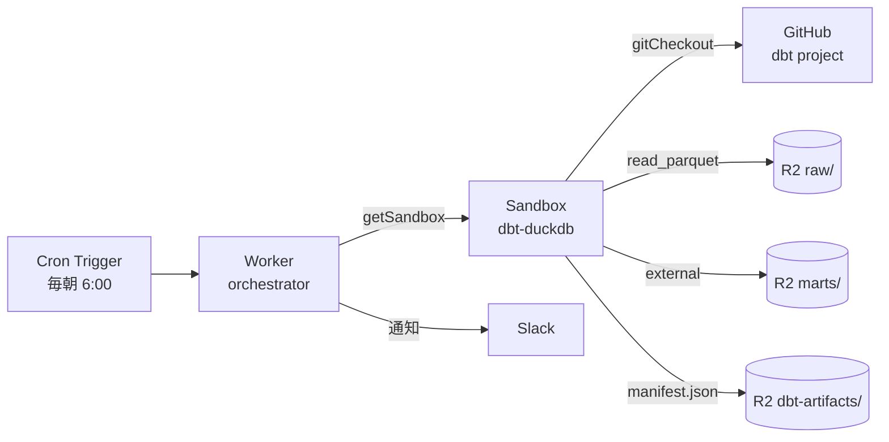
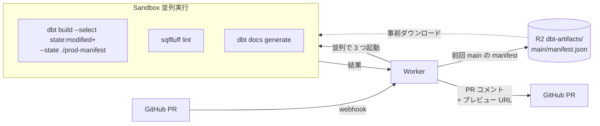

# dbt を Cloudflare 環境で動かす

<!--
データ変換のデファクト dbt を、外部 DWH や dbt Cloud 無しで Cloudflare 一社で
回せるようになったのが 2026 年。詰まっていた点が解消した理由と、嬉しさを 4 枚で見せる。
-->

---

# 詰まっていた 3 点が解消した

dbt を Cloudflare で動かす上で **長年詰まっていた 3 点**が、最近一気に解消した。

- **Outbound Workers** — Container から R2 へ **API トークン無し** で読み書き可能に
- **Sandbox / Containers GA** — `gitCheckout` 1 行で dbt project を持ってきて `pip install dbt-duckdb && dbt build`
- **R2 Data Catalog** (Iceberg) — Pipelines で書き込んだ raw を dbt の source として参照

<div class="mt-6 border border-orange-500/30 rounded p-3 text-sm">

**核**: dbt の T を **Cloudflare 完結** で回せるようになった。L (load) は Pipelines / dlt、保存は R2 + Iceberg、変換は Sandbox + dbt-duckdb、配信は Workers Static Assets。**外部 DWH 不要、`$100/月` のマネージド SaaS 不要**。

</div>

<!--
dbt を Cloudflare で動かす構想は前からあったものの、3 つの障害で本番には載せられなかった。
1 つは Container から R2 を叩くのに API トークンが必要だった点。
2 つは dbt の起動コスト 30 秒問題、3 つは Iceberg 標準のマネージド Catalog がなかった点。
それぞれ 2026-03-26 Outbound Workers GA、2026-04-13 Sandbox/Containers GA、
R2 Data Catalog (2025-09 GA + 自動コンパクション) が出揃って解決された。
Outbound Workers でキー無し R2、Sandbox の snapshot で起動 2 秒、
R2 Data Catalog で Iceberg 標準。これで dbt の T を全部 Cloudflare で完結できるように
なった、という瞬間。
-->

---

# アーキテクチャ — Cron → Worker → Sandbox → R2



- **Worker は薄いオーケストレーター**: Cron で起動、Sandbox を取り、結果を Slack 通知
- **Sandbox が dbt 実行本体**: `gitCheckout` で 1 行 clone、`dbt build` 1 行で完結
- **R2 が永続層**: 入力 Parquet も出力 marts もすべて R2、エグレス $0

```typescript
// src/worker.ts
const sandbox = getSandbox(env.Sandbox, `dbt-${runId}`);
await sandbox.gitCheckout(repo, { depth: 1, targetDir: "/w" });
const result = await sandbox.exec(
  "cd /w && pip install -r requirements.txt && dbt build",
  { timeout: 30 * 60 * 1000 }
);
```

<!--
全体像はこの 1 枚で説明できる。Cron Trigger が毎朝 Worker を叩いて、
Worker が Sandbox を立ち上げ、Sandbox の中で dbt-duckdb を pip install してから
dbt build。入力データは R2 の raw/ から read_parquet で読んで、
出力 marts/ も Parquet で R2 に書き戻す。Sandbox は実体は Durable Object + Firecracker
microVM なので、毎回真っさらの環境が立つ。コードは 10 行ちょっと。
従来の Airflow + EC2 構成と比べると Wrangler deploy 1 発で完結し、月額 1〜5 ドル。
-->

---

# Slim CI — 変更したモデルだけ test

PR 単位で **全モデルを test するのは時間とコストの無駄**。前回 main の `manifest.json` と PR の差分を比較して、**変更箇所と下流だけ** を回す。



- **`state:modified+` セレクタ**: 変更モデル + その下流のみを対象 (dbt-core 標準)
- **前回 main の `manifest.json`** を R2 の `dbt-artifacts/main/` に保存しておく
- **Sandbox 3 並列**: test / lint / docs を `Promise.all` で同時実行 — 直列なら 6 分が 2 分に
- 結果を **PR にコメント + docs プレビュー URL** を貼る

<!--
Slim CI は dbt の標準機能で、PR で変更したモデルだけを test する仕組み。
前回 main で生成した manifest.json と今回 PR の manifest を比較して、
変更ノードとその下流だけ走らせる。これは dbt-core の state:modified+ セレクタで
できる。前回 manifest を R2 の dbt-artifacts/main/ に毎日 build 後に保存しておけば、
Sandbox から事前ダウンロードして --state フラグに渡すだけ。
さらに Sandbox 3 並列で test/lint/docs を Promise.all すると、直列 6 分が 2 分に縮む。
GitHub Actions だとジョブ間データ受け渡しがファイル経由で面倒だが、
Sandbox なら変数で直接 — これが Cloudflare 完結の真価。
-->

---

# 嬉しさは「全部 Cloudflare で閉じる」こと

<div class="grid grid-cols-3 gap-4 mt-6">

<div class="border border-orange-500/30 rounded p-4">

### 💰 コスト

`$100+/月` のマネージド dbt SaaS → **`$5/月`** の Workers Paid + Sandbox

R2 → 外部 DWH のエグレス **$0** (Iceberg REST 経由)

</div>

<div class="border border-orange-500/30 rounded p-4">

### 📚 dbt docs を Zero Trust で配信

```bash
uv run dbt docs generate
cd target && wrangler deploy
```

→ Workers Static Assets + **Cloudflare Access** で社内限定の dbt ドキュメントサイト完成

</div>

<div class="border border-orange-500/30 rounded p-4">

### 🔍 Correlated Logs

`Worker → DO → Container` の dbt run トレースが **1 画面**で時系列表示

エージェント駆動 dbt の監査基盤

</div>

</div>

<div class="mt-6 text-sm op-80">

**全振りでなくてもいい**: 重い集約は Snowflake、軽い下流 mart は Sandbox + dbt-duckdb の **ハイブリッド** も現実解。R2 を共通基盤に dbt を 2 系統並走できる。

</div>

<!--
嬉しいのはコストだけじゃない。マネージド SaaS の 100 ドル超えが 5 ドルになるのも大きいが、
本当の価値は単一プロバイダで全部閉じることにある。dbt docs の社内配信は地味だが
他社サービスでは一番不自由する部分。Cloudflare なら wrangler deploy 1 発 + Access で
30 秒で組める。さらに 2026-04-21 に出たばかりの Correlated Logs で、
Worker / DO / Container のログが 1 画面で時系列表示される。エージェントが
dbt モデルを自動生成する時代の監査基盤として強い。なお、外部 DWH を捨てる必要は
なくて、重い集約は Snowflake、軽い下流マートは Sandbox という二刀流が現実的。
-->
