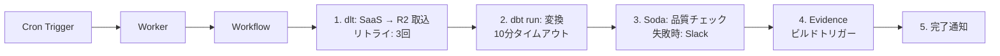

# オーケストレーション

---

# ワークフローの Durability 問題

データパイプラインは長時間実行される。その間に何が起きるか。

<div class="grid grid-cols-2 gap-6 mt-4">
<div>

### 直面する現実

- **プロセスクラッシュ** — OOM / ランタイム再起動 / デプロイ切替
- **長期待機** — 夜間バッチの次ステップまで 8 時間、人間の承認待ち 3 日
- **外部 API の一時障害** — リトライ待ちで数十分眠る
- **重複実行** — 同じ step が 2 回走ると副作用が重複する
- **途中経過の消失** — 10 step のうち 7 まで終えた状態をどう残す？

</div>
<div>

### 必要な保証

- 「どこまで進んだか」の **永続化**
- クラッシュ後に **途中から再開**
- 各 step は **at-least-once** で実行される
- 長期待機中は **計算リソースを使わない**

<div class="mt-4 text-sm opacity-80">
素朴に自前で書くと、状態テーブル・冪等キー・リトライキュー・タイマー ...<br>
実質「分散システムの難問」の再発明になる。
</div>

</div>
</div>

| 従来の選択肢 | 運用上の辛さ |
|---|---|
| Airflow | scheduler / worker / DB を自前運用 |
| Temporal | セルフホストなら worker プール管理 |
| Step Functions | フローを JSON (ASL) で書く |
| 自前 state + retry loop | バグの温床 |

---

# Cloudflare Workflows の解決策

基本アイデア: **各 step の結果を自動永続化し、クラッシュ後はリプレイで state を復元する。**

<div class="grid grid-cols-2 gap-6 mt-4">
<div>

### フレームワークが保証するもの

- **Event Sourcing** — `step.do()` の戻り値を実行時に自動永続化
- **Deterministic Replay** — クラッシュ後はログから state を再構築し、**未実行の step から再開**
- **Hibernation** — `step.sleep()` / `step.waitForEvent()` 中はプロセス停止、**課金されない**（最大 365 日）
- **Retry ポリシー** — step 単位で再試行回数・バックオフを宣言的に設定

</div>
<div>

### 裏側は Durable Objects

- **1 workflow instance = 1 Durable Object**
- DO の **シングルライター保証** が、step ログ書き込みの整合性をそのまま担保
- state は DO の **SQLite ストレージ** に蓄積
- Workers から `env.MY_WORKFLOW.create({ id, params })` で起動 → Binding で型安全

<div class="mt-3 text-sm opacity-80">
先に見た DO の <strong>グローバル一意 ID + 永続ストレージ</strong> が、Workflows の実行モデルをそのまま支えている。
</div>

</div>
</div>

### 開発者側に残る責務 — 冪等性と決定性

- step 内の副作用は **冪等** に書く（at-least-once = 重複実行される可能性あり）
- 非決定的な値は **必ず `step.do` 内に包む**（`Date.now()` / `crypto.randomUUID()` / 外部 API レスポンス）

```ts
// NG: workflow 本体で直接呼ぶとリプレイ時に値がズレる
const now = Date.now();

// OK: step.do 内で実行 → 結果が永続化され、リプレイ時は同じ値が返る
const now = await step.do("timestamp", async () => Date.now());
```

---

# Workflows — サーバーレス耐久実行エンジン

Temporal / Step Functions に相当。TypeScript でコードとして定義。



- **`step.do()`** — 処理ステップ定義。戻り値は自動永続化
- **`step.sleep()`** — 待機（最大365日）
- **`step.waitForEvent()`** — 外部イベント待機（人間の承認フロー）
- **クラッシュ耐性** — 途中から再開（Durable Objects が状態保持）

<div class="mt-4 text-sm op-70">

**vs Step Functions**: Step Functions は ASL（JSON）でフロー定義。Workflows は TypeScript でロジックとフローが一体。Step Functions の方がビジュアルエディタ・実行履歴UIが成熟。Workflows はコードファーストで軽量だが、GUI での可視化は弱い。

</div>
