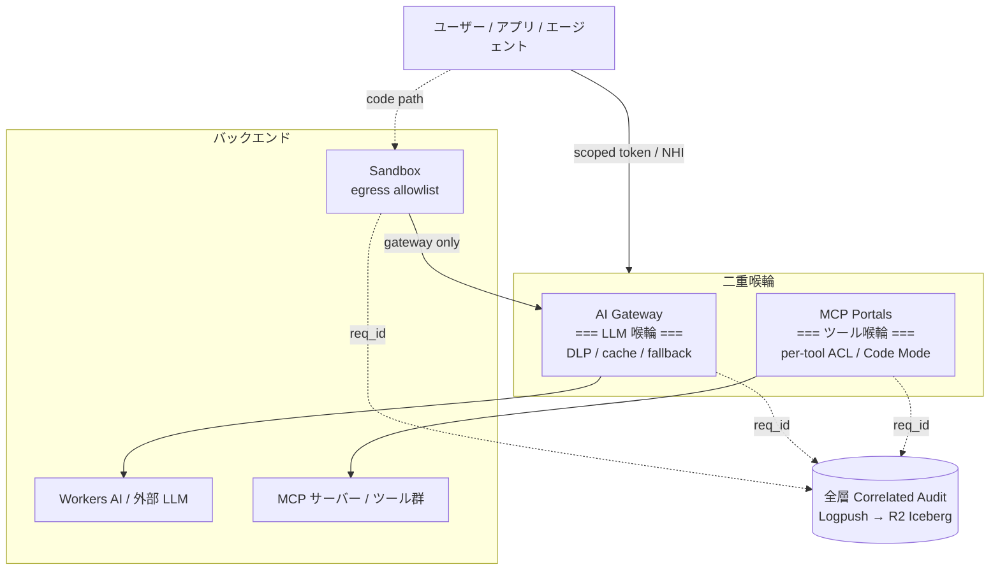

# AI スプロールをどうにかする

<!--
AI ツール / モデル / エージェントが組織内で散らばる sprawl 問題に対し、
Cloudflare の AI Gateway と MCP Portals が「LLM の喉輪」と「ツールの喉輪」
の二重喉輪を提供する、という構図を 3 枚で見せる。
クラウドスプロール史の再演として位置づけ、構造で発生不能にする思想を強調。
-->

---

# AI スプロール — クラウドスプロールの再演

組織内で **AI モデル / エージェント / ツール / プロンプト**が無秩序に増殖し統制不能になる状態。

<div class="text-sm mt-4">

| 時代 | 散らばる対象 | 防衛機構 |
|---|---|---|
| 2000 年代後半 | SaaS スプロール | SaaS 管理プラットフォーム |
| 2010 年代 | クラウドスプロール (EC2 / S3 氾濫) | FinOps / CMDB |
| 2020 年代前半 | ツールスプロール | プラットフォームエンジニアリング |
| **2020 年代後半** | **AI スプロール** | **AI Gateway / NHI / MCP Portals** |

</div>

<div class="mt-4 grid grid-cols-3 gap-3 text-sm">

<div class="border border-orange-500/30 rounded p-3">

### コスト不透明

トークンと GPU 秒が **FinOps 対象外** で運用。同一プロンプトが 5–10 回重複呼び出し

</div>

<div class="border border-orange-500/30 rounded p-3">

### Shadow AI

調査では **従業員の 11.6%** が機密データを外部 LLM に貼付 (Cyberhaven, 2024)

</div>

<div class="border border-orange-500/30 rounded p-3">

### 責任追跡 不能

「**どの根拠で何を答えたか**」を後から再構成できず、誤回答時の説明責任が果たせない

</div>

</div>

<!--
AI スプロールは新しい問題ではなく、クラウドスプロールやツールスプロールの
系譜にある。2010 年代に EC2 や S3 が氾濫して FinOps が生まれたのと同じ構造で、
今はトークンと GPU 秒が新しい単位経済性の対象。代表的な実害は 3 つ。
コストが見えない、Shadow AI で機密が外に漏れる、誤回答時に何を根拠にしたかが
追えない。Cyberhaven の 2024 年調査では従業員の 11.6 パーセントが機密データを
外部 LLM に貼り付けている、という数字が出ている。
試しやすさの罠と、エージェントの自己増殖、評価基準の未整備が重なって、
監視で検知だけでは追いつかなくなる。次の枚で構造で発生不能にする話に行く。
-->

---

# Cloudflare の二重喉輪 — LLM 層 + ツール層

LLM 呼び出しは **AI Gateway**、ツール呼び出しは **MCP Portals**。両方の経路が **強制**されることで初めてスプロールが構造的に止まる。



<div class="grid grid-cols-3 gap-3 mt-4 text-sm">

<div class="border border-orange-500/30 rounded p-3">

**LLM 喉輪**: AI Gateway

DLP / セマンティックキャッシュ / モデルフォールバック / メタデータタグ

</div>

<div class="border border-orange-500/30 rounded p-3">

**ツール喉輪**: MCP Portals

per-tool ACL / Code Mode で ~94% トークン削減 / SIEM 連携

</div>

<div class="border border-orange-500/30 rounded p-3">

**全層 Audit**: 5 層 Correlated Logs

`request_id` で AI Gateway / MCP / Worker / DO / Sandbox を串刺し

</div>

</div>

<!--
Cloudflare は LLM 層とツール層に二重の喉輪を置いている。
LLM 側は AI Gateway で全プロバイダーの呼び出しを 1 経路に集約し、
DLP・キャッシュ・フォールバック・メタデータを統一管理。
ツール側は MCP Portals でツール単位の Access ポリシー、
Code Mode による大幅なトークン圧縮、SIEM 連携が一発で組める。
さらに重要なのが、Sandbox の egress allowlist で Gateway 以外を物理封鎖
できる点。これで SDK 直叩きを規約ではなく構造で禁止できる。
全層が同じ request_id で Logpush に流れて、R2 Iceberg に SQL 監査として
落ちる。事故時に「何を根拠にどう答えたか」を 1 クエリで再現できる、
というのが二重喉輪 + 全層 audit の効き目。
-->

---

# 事例 → 対処 → 効果 — 構造で発生不能にする

<div class="border border-red-500/40 rounded p-3 mt-4 text-sm">

### 事例: **IDE エージェントが本番 DB を `DROP TABLE` した**

エージェントに本番リソースの破壊的 binding が渡されており、承認ゲートも無かった

</div>

<div class="grid grid-cols-2 gap-4 mt-4 text-sm">

<div class="border border-orange-500/30 rounded p-3">

### 対処 ① — Capability で縛る

Workers Binding は **渡してない = 触る手段が存在しない**

```jsonc
"services": [
  { "binding": "READ_DB", "service": "db-reader" }
  // 破壊用 binding は意図的に渡さない
]
```

</div>

<div class="border border-orange-500/30 rounded p-3">

### 対処 ② — 承認 step を挟む

破壊的操作は Workflows の `waitForEvent` で人間に渡す

```typescript
const ok = await step.waitForEvent(
  "human-approval", { timeout: "1 hour" }
);
if (!ok.approved) return;
await step.do("delete", () =>
  env.DB.prepare(sql).run()
);
```

</div>

</div>

<div class="mt-4 border border-orange-500/30 rounded p-4">

### 共通する 3 つの設計原則

1. **強制経路を作る** — AI Gateway / MCP Portals を通る以外の選択肢を消す
2. **Capability で縛る** — 触れる手段そのものを binding で限定
3. **`request_id` で全層を紐付ける** — 後追い可能性を構造で担保

**監視で検知ではなく、構造で発生不能にする**

</div>

<!--
具体例で見せる。IDE 統合のエージェントが暴走して、本番 DB を DROP TABLE で
吹き飛ばした、という事故。原因は破壊的操作の binding をエージェントに
渡していたこと、と承認ゲートが無かったこと。
Cloudflare では Workers の binding が capability-based なので、渡していない
binding は触る手段そのものが存在しない。これが対処 1。
さらに破壊的な操作は Workflows の waitForEvent で人間の承認を待つ step を
挟むことで、承認されない限り永久に保留される。
事例ごとに primitive は違うが、共通するのは 3 つの設計原則。
強制経路を作る、capability で縛る、request_id で全層を紐付ける。
監視で検知するのではなく、構造的に発生不能にする思想で組むのが Cloudflare 的。
-->

---
