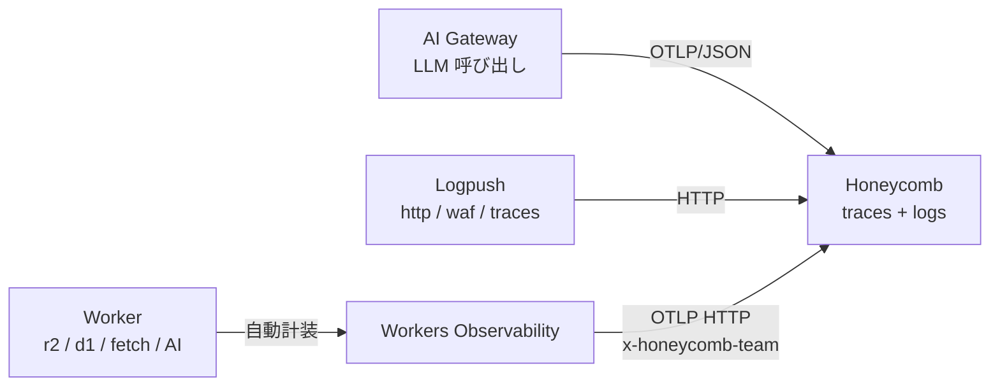

# Observability と AI 統制

<!--
Cloudflare で AI スタックを「見る + 統制する」 2 軸を 1 章で扱う。
- 観測 (telemetry): Workers Obs / Logpush + Log Explorer / AI Gateway / Analytics Engine の 4 source
- 統制 (governance): AI Gateway (LLM 層) + MCP Server Portal (ツール層) の 2 portal
- 集約: OTel で外に出して Honeycomb に束ねる → 脱ベンダーロックイン

LLM 呼び出しとツール呼び出しが社内に散らばる sprawl 問題に対し、Cloudflare は
LLM 層を AI Gateway、ツール層を MCP Server Portal で集約・統制する 2 つの portal を
提供する。観測と統制を同じ章で扱うことで「見るために統制する / 統制するために見る」
の循環を 1 つのストーリーで通せる。
-->

---

# Cloudflare の telemetry source

Cloudflare 製品から **4 つの源泉**が取れます。

<div class="grid grid-cols-2 gap-3 mt-3 text-sm">

<div class="border border-orange-500/30 rounded p-3">

### Workers Observability
Worker 内の操作（R2 / D1 / fetch / Queue / AI）の **trace + log**。`observability.traces.enabled = true` の **1 行で有効化**。

</div>

<div class="border border-orange-500/30 rounded p-3">

### Logpush + Log Explorer
Cloudflare 製品ログ（HTTP / WAF / DNS / Workers traces 等）。**外に push** か **中で SQL クエリ** を選べます。

</div>

<div class="border border-orange-500/30 rounded p-3">

### AI Gateway
LLM 呼び出しの **span**（Gen AI セマンティック規約準拠）。次の 2 スライドで詳述。

</div>

<div class="border border-orange-500/30 rounded p-3">

### Analytics Engine
Worker から `writeDataPoint` で書く **高カーディナリティ時系列**。OTel ではなく SQL API でクエリ。

</div>

</div>

<div class="mt-3 text-sm op-80">

→ Analytics Engine 以外は外部バックエンドに直送できます（Workers Obs / AI Gateway は **OTLP**、Logpush は **HTTP destination**）。

</div>

<!--
4 つの telemetry source の概要:

(1) Workers Observability — Cloudflare 純正のテレメトリ基盤。R2 / D1 / fetch /
Queue / Workers AI など Worker 内の主要操作が全部自動でスパン化される。SDK 不要、
wrangler.jsonc に enabled: true を書くだけ。本番では head_sampling_rate: 0.05 で
5% に絞ってコストを抑えつつ代表的なトレースが取れる、という運用がベース。

(2) Logpush + Log Explorer — 同じ source データに対して 2 つの取り回し。
Logpush は数分間隔のバッチで R2 / S3 / GCS / Datadog / Splunk / Pipelines /
汎用 HTTP に push。Log Explorer は SQL API で同じ datasets をその場でクエリ、
契約で最大 2 年保持。datasets は両者共通: http_requests / firewall_events /
workers_trace_events / dns_logs / access_requests など。

(3) AI Gateway — LLM 呼び出しの reverse proxy。Universal Endpoint で全プロバイダー
を 1 URL に集約、Gen AI セマンティック規約準拠の span を OTLP/JSON で吐ける。
governance + telemetry の交差点で、次の 2 スライドで詳述。

(4) Analytics Engine — Worker 専用の時系列カスタムイベントストア。
env.X.writeDataPoint() で書き込み、SQL API でクエリ。blobs (文字列 最大 20) /
doubles (数値 最大 20) / indexes (サンプリングキー) の 3 種類。最大の特徴は
無制限カーディナリティで、user_id や tenant のような無限増えるディメンションでも
扱える。保持 90 日。OTel ではないので Honeycomb への直送は無く、SQL で必要に
応じて取り出す。

最初の 3 つは OTel で外部集約可能、Analytics Engine だけ Cloudflare 内完結。
-->

---

# AI Gateway — LLM 呼び出しを統制する

**Universal Endpoint** で全 LLM プロバイダーを 1 経路に集約します。**Fallback / Retry** で信頼性を担保しつつ、以下 3 カテゴリ・11 機能で観測 / 制御 / 最適化を一括導入できます。

<div class="grid grid-cols-3 gap-3 mt-3 text-xs">

<div class="border border-orange-500/30 rounded p-3">

### Performance & Cost

- **Caching** — 同一リクエストをキャッシュ (latency 最大 90% 減)
- **Rate Limiting** — 時間枠ごとのリクエスト数上限
- **Dynamic Routing** — segment / geo / content で振り分け
- **Custom Costs** — 交渉済みレートでコスト計算を上書き

</div>

<div class="border border-orange-500/30 rounded p-3">

### Security & Safety

- **Guardrails** — 有害コンテンツの検出 / ブロック
- **DLP** — PII / 財務情報をパターン検出 (`FLAG` / `BLOCK`)
- **Authentication** — Gateway へのトークンベースアクセス制御
- **BYOK** — provider API キーを集中暗号化管理 (20+ providers)

</div>

<div class="border border-orange-500/30 rounded p-3">

### Observability & Analytics

- **Analytics** — トークン / コスト / エラーを集計
- **Logging** — 全 request / response の詳細ログ
- **Custom Metadata** — `cf-aig-metadata` で user / team タグ

</div>

</div>

<div class="mt-3 text-sm op-80">

→ 「LLM SDK を直接叩く」をやめて Gateway 経由を強制すれば、観測 / 統制 / コスト管理を後付けで実装する必要がなくなります。

</div>

<!--
AI Gateway は LLM 呼び出しの reverse proxy。Universal Endpoint で全プロバイダー
(OpenAI / Anthropic / Workers AI / Google Vertex / DeepSeek / Azure OpenAI /
Perplexity 等 20+) を 1 URL に集約する。本文には他社名を出さず「全 LLM
プロバイダー」の表現に留める。

基盤メカニズム (intro 行に集約):
- Universal Endpoint: 全 provider を 1 URL でルーティング
- Fallback: provider / model 障害時の自動切替 (cf-aig-step で経路追跡)
- Retry: タイムアウト / 失敗時の再試行ポリシー

公式 Features ページに従って 3 カテゴリ・11 機能:

(1) Performance & Cost Optimization
- Caching: 意味的に同じリクエストをキャッシュしてレイテンシ最大 90% 削減 + コスト削減
- Rate Limiting: 時間枠ごとのリクエスト上限。API クォータ枯渇を構造で防止
- Dynamic Routing: ユーザーセグメント / 地理 / コンテンツ分析でリクエストを
  ルーティング。A/B テストやリージョナル振り分けが宣言的に書ける
- Custom Costs: 交渉済みレートやカスタムコストモデルで集計上の料金を上書き、
  正確な部署別 / 顧客別の課金ロジックが組める

(2) Security & Safety
- Guardrails: プロンプトと応答の有害コンテンツをリアルタイム検出 / ブロック。
  Hallucination / プロンプトインジェクション / 不適切発言の対策
- DLP: PII / 財務データなどの機密情報をパターンマッチで FLAG / BLOCK。
  GDPR / HIPAA 等のコンプライアンス文脈で使う
- Authentication: Gateway 自体へのトークンベースアクセス制御
- BYOK: provider API キーを Cloudflare の暗号化インフラで集中管理。アプリ側の
  secrets に API キーを置かなくて済む (Workers Secrets と二重で守れる)

(3) Observability & Analytics
- Analytics: リクエスト数 / トークン / コスト / エラーをダッシュボードで集計
- Logging: 全リクエスト / レスポンスの詳細ログ。デバッグ / 監査 / 分析に
- Custom Metadata: cf-aig-metadata ヘッダで user_id / team / version 等を付与、
  「どの部署のどのユーザーが何モデルをいくら使ったか」を後追いできる

BYOK + Custom Costs + Guardrails の 3 つは特に効くポイント。Guardrails (有害
コンテンツ検出) は DLP (機密情報) と並ぶ統制の柱として強調できる。
-->

---

# AI Gateway も OTel — LLM スパンが同じトレースに繋がる

AI Gateway 経由の **全 LLM 呼び出し**を **Gen AI セマンティック規約**準拠の span として OTLP エクスポートできます。Workers Observability と組み合わせると、Worker → Gateway → LLM が **1 つのトレース**に束ねられます。

<div class="grid grid-cols-2 gap-4 mt-4 text-sm">

<div class="border border-orange-500/30 rounded p-3">

### 自動付与される span 属性

- `gen_ai.request.model` / `gen_ai.model.provider`
- `gen_ai.usage.input_tokens` / `output_tokens`
- `gen_ai.prompt_json` / `gen_ai.completion_json`
- `cf-aig-metadata` ヘッダの値 (team / user 等)

</div>

<div class="border border-orange-500/30 rounded p-3">

### Trace Context 伝播

Worker から `cf-aig-otel-trace-id` / `cf-aig-otel-parent-span-id` を渡せば、**Worker のトレースに LLM 呼び出しが直接ぶら下がります**

→ レイテンシ / コスト / モデル別使用量を **Worker のスパンと同じ画面で相関**

</div>

</div>

<div class="mt-4 border border-orange-500/30 rounded p-3 text-sm">

**設定**: AI Gateway ダッシュボード → Settings → OTel exporter で OTLP/JSON エンドポイントと認可ヘッダを登録 (Honeycomb など OTLP/JSON 対応バックエンド)

</div>

<!--
AI Gateway は独自の OTLP エクスポート機能を持っていて、Gen AI セマンティック
規約に準拠した span を吐ける。属性としては gen_ai.request.model でモデル名、
gen_ai.usage に input_tokens / output_tokens、それからプロンプト本文と
レスポンス本文も span に乗る (秘匿したい場合は別途設定で除外可能)。
重要なのが trace context 伝播で、Worker 側で cf-aig-otel-trace-id ヘッダを
渡せば、AI Gateway 側の LLM 呼び出しが Worker のトレースに 1 階層下のスパン
としてぶら下がる。これでリクエスト全体のレイテンシ、トークンコスト、モデル別
使用量を、Worker のログと同じバックエンドで相関分析できる。
設定は AI Gateway ダッシュボードの Settings タブから OTel exporter を追加するだけ。
ただし AI Gateway 側は OTLP/JSON のみで protobuf 形式は非対応なので、
バックエンド選定の際はそこだけ注意。
-->

---

# MCP Server Portal — MCP サーバーを統制する

組織内で乱立する MCP server (= LLM が叩く外部ツール群) を **中央集約してアクセス制御** する portal です。**Cloudflare Access** が認証 / 認可 / 監査を担当します。

<div class="grid grid-cols-2 gap-4 mt-4 text-sm">

<div class="border border-orange-500/30 rounded p-3">

### 集約 / 認証

- **1 つの portal URL に複数 MCP server を集約** (内部 + サードパーティ + SaaS 系)
- **OAuth 2.0** (managed OAuth) で MCP クライアントを認証
- **SSO / MFA** を前段に挟める (Access 経由)

</div>

<div class="border border-orange-500/30 rounded p-3">

### 統制 / 最適化

- **3 軸ポリシー**: Identity (誰が) / Conditions (どの条件で) / Scope (どの tool まで)
- **Code Mode**: 全 tool 定義を 1 つの `code` tool に圧縮 → context window 削減
- **監査ログ**: 全 tool 実行を Access logs に記録 → SIEM / Logpush 連携

</div>

</div>

<div class="mt-4 text-sm op-80">

→ "**Shadow MCP**" (社員が勝手にローカルで MCP server を立てて社内データに繋ぐ) を **構造で防ぎます**。観測対象を一元化することで、AI Gateway と合わせて 「LLM 層 + ツール層」の二重統制が成立します。

</div>

<!--
MCP server portal は Cloudflare Access の AI controls 配下に提供されている機能で、
組織内の MCP server を中央管理するための portal。Shadow MCP (社員が勝手にローカル
で MCP server を立てて社内 DB / Notion / GitHub 等に繋ぐ) を、Access 経由の
gateway を強制することで構造的に止める設計。

(1) 集約: 内部 (self-hosted)、SaaS (Access for SaaS 経由)、サードパーティ
(OAuth 連携) の 3 種類の MCP server を 1 つの portal URL に束ねられる。MCP
クライアント (LLM 側) は portal URL 1 つだけ知っていればよい。

(2) 認証: OAuth 2.0 の authorization code flow (managed OAuth) で MCP クライアントを
認証。非ブラウザクライアントには 401 + WWW-Authenticate ヘッダで Access の OAuth
discovery エンドポイントを案内する仕様。

(3) ポリシー: Access の標準ポリシーが効くので、Identity / Conditions / Scope の
3 軸で粒度の細かい制御が可能。「特定 tool だけ許可」「device posture が OK
なときのみ許可」など。

(4) Code Mode: portal の機能で、複数 MCP server の全 tool 定義を 1 つの code tool に
畳み込み、LLM の context window 使用量を抑える。tool 定義が肥大化したときの
解。code path を経由する以上、AI Gateway との二重ゲートが取れる。

(5) 監査: Access logs に「どのユーザーがどの tool をいつ実行したか」が記録される。
Logpush で R2 / Iceberg / Honeycomb に流せば、AI Gateway logs と組み合わせて
LLM 層 + ツール層の Correlated audit が成立する。

事故シナリオ (IDE エージェントが本番 DB を DROP) → 対処は MCP Portal で破壊的
tool を Scope から外す + AI Gateway で DLP に「DROP TABLE 等の SQL パターン」を
ブロックリストに追加 + Workflows の waitForEvent で人間承認を挟む、の組合せで
構造的に発生不能にできる。
-->

---

# OTLP で Honeycomb へ送る

Workers Observability / AI Gateway は **OTLP HTTP** で外部バックエンドにそのまま送れます。Logpush は HTTP destination で Honeycomb の Logpush integration に直送できます。



- **Honeycomb** は OpenTelemetry リファレンスバックエンド
- Workers Observability の **Day 1 サポート対象** (Grafana / Honeycomb / Sentry / Axiom)
- API キー 1 個で完結 (`x-honeycomb-team` ヘッダ)
- dataset は OTLP の `service.name` 属性で**自動分離**

<div class="text-sm op-80 mt-3">

```
OTLP Endpoint: https://api.honeycomb.io/v1/traces
Custom Header: x-honeycomb-team: <HONEYCOMB_API_KEY>
```

</div>

<!--
4 つの source のうち 3 つ (Workers Obs / AI Gateway / Logpush) は Honeycomb
に集約できる。Workers Obs と AI Gateway は OTLP HTTP で直接、Logpush は
Honeycomb の Logpush 受け口に HTTP で送る。
Analytics Engine だけは OTel ではなく Cloudflare 内 SQL API なので、
Honeycomb に直送する標準機能は無い。SQL でクエリした結果を別途取り込む形に
なる (アプリ独自の業務メトリクスは Cloudflare 内で完結させる方が自然な選択)。
Honeycomb は OpenTelemetry プロジェクトの主要貢献者で "observability" 概念の
伝道元、OTel-native 設計が一番自然に刺さる。Cloudflare 公式の Day 1 サポート
対象なのでドキュメントも揃っている。
設定は API キー 1 個を x-honeycomb-team ヘッダに入れるだけ。dataset (Honeycomb
内の論理区切り) は OTLP の service.name で自動分離されるので、他の宛先と比べて
最も簡素。
全部 OTel 標準で送るので、Honeycomb から Grafana / Datadog / Sentry に乗り換える
時も destinations 設定を差し替えるだけで済む = ベンダーロックインを構造で回避
できる、というのがこの構成の根本的な価値。
-->
