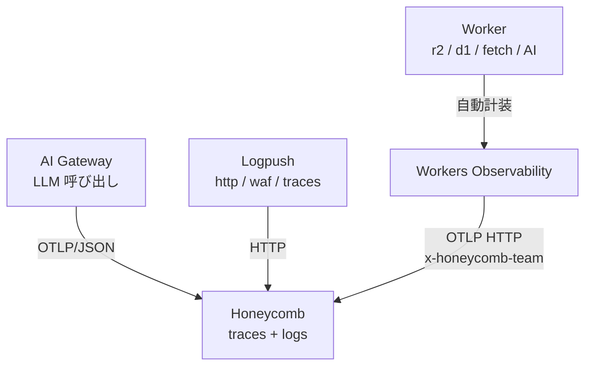

# Observability

<!--
ここから「見る」と「統制する」の話に入ります。
-->

---

# [Workers Logs](https://developers.cloudflare.com/workers/observability/logs/workers-logs/)

Worker が出すログ (`workers_trace_events`) を、用途で 4 経路に振り分けます。

- [**Workers Logs**](https://developers.cloudflare.com/workers/observability/logs/workers-logs/): ダッシュボードに自動収集（保持 7 日）→ 普段使いのログ閲覧
- [**Real-time Logs**](https://developers.cloudflare.com/workers/observability/logs/real-time-logs/): near real-time の live tail（保存はされない）→ デプロイ直後の動作確認
- [**Tail Workers**](https://developers.cloudflare.com/workers/observability/logs/tail-workers/): 別 Worker でログを受けて filtering / sampling / 変換 / export → カスタム加工・別宛先転送
- [**Workers Logpush**](https://developers.cloudflare.com/workers/observability/logs/logpush/): 外部 destination に数分バッチで push（R2 / Pipelines / 汎用 HTTP / SIEM）→ 既存 SIEM / DWH 連携・長期保管

→ **Invocation logs / Custom logs / Errors / Uncaught exceptions** が共通の元データ。`console.log` を JSON object にすると自動でフィールド抽出。

→ Workers Observability の Destinations から **OpenTelemetry 互換**でエクスポート可能。

<!--
Worker が出すログは、用途別に 4 経路に振り分けられます。

普段使いはダッシュボードに自動収集される Workers Logs、
デプロイ直後の確認は live tail の Real-time Logs、
自前で加工したいときは Tail Workers、
既存 SIEM や DWH に長期 push したい場合は Workers Logpush。

共通の元データは Invocation logs と Custom logs などで、
console.log を JSON object にすると自動でフィールド抽出されます。
OpenTelemetry 互換でエクスポートも可能です。
-->

---

# [Workers Metrics & Analytics](https://developers.cloudflare.com/workers/observability/metrics-and-analytics/)

dashboard と API で **何が / どれくらい / どう動いたか** を測れます。

- **Built-in メトリクス**: Requests / Subrequests / Wall Time / CPU Time / Execution Duration（保持 3 ヶ月）→ Worker の基本健康状態を把握
- [**GraphQL Analytics API**](https://developers.cloudflare.com/analytics/graphql-api/): 1 endpoint で Workers / KV / D1 / Workflows などを横断クエリ → 複数プロダクト集計・カスタムダッシュボード
- [**Workers Analytics Engine**](https://developers.cloudflare.com/analytics/analytics-engine/): アプリ独自の高カーディナリティ時系列（保持 90 日、ClickHouse-like な columnar store）→ 業務メトリクス・per-user / per-tenant 計測

→ Worker から **OpenTelemetry SDK で custom metrics を push** も可能（built-in は GraphQL / SQL API 経由）。

<!--
メトリクスは 3 系統あります。
Built-in メトリクスが Requests / CPU Time など Worker の基本健康状態、
GraphQL Analytics API が 1 エンドポイントで複数プロダクトを横断クエリ、
Workers Analytics Engine が高カーディナリティの業務メトリクス用の columnar store です。

custom metrics は OpenTelemetry SDK 経由で外に push もできます。
-->

---

# [Workers Traces](https://developers.cloudflare.com/workers/observability/traces/)

`observability.tracing.enabled = true` の **1 行で自動 span 化**（OpenTelemetry 互換）。

- **自動 span**: Fetch / Binding (KV / R2 / DO) / Handler (`fetch` / `scheduled` / `queue`)
- **共通属性**: `cloud.*` / `faas.*` / `service.name` / `cloudflare.*` / `telemetry.sdk.*`
- **OpenTelemetry 互換バックエンドに直送**（OTLP HTTP）、`head_sampling_rate` 0〜1 でコスト調整

→ **使い時**: ボトルネック特定 / 外部依存のレイテンシ可視化 / リクエスト全体のライフサイクル追跡

→ **制約 (beta)**: 非 I/O は `0ms` / 外部 trace context 非伝播 / Service Binding と DO は別 trace

<!--
observability.tracing.enabled = true の 1 行で、自動 span 化です。
OpenTelemetry 互換。

Fetch、Binding、Handler が共通形で span 化されるので、
Worker から R2 や D1、外部 API までの全体トレースが何もせずに取れます。

head_sampling_rate でコスト調整、
OTLP HTTP で任意のバックエンドへ直送できます。
-->

---
layout: two-cols-header
---

# [AI Gateway](https://developers.cloudflare.com/ai-gateway/)

[**Universal Endpoint**](https://developers.cloudflare.com/ai-gateway/usage/universal/) で全 LLM プロバイダーを 1 経路に集約。**Fallback / Retry** 込みで以下の 3 カテゴリ・11 機能を一括導入できます。

::left::

<div class="text-xs">

- **Performance & Cost**: Caching / Rate Limiting / Dynamic Routing / Custom Costs → コスト・レイテンシを下げたい
- **Security & Safety**: Guardrails / DLP / Authentication / BYOK → 機密情報・有害コンテンツを構造で防ぎたい
- **Observability & Analytics**: Analytics / Logging / Custom Metadata → 部署 / ユーザー別の使用状況を可視化したい

</div>

→ Gateway 経由を強制すれば、観測 / 統制 / コスト管理を後付けで実装する必要がなくなります。AI Sprawl の解決策の一つに。

::right::


<!--
AI Gateway は LLM 呼び出しの reverse proxy です。
Universal Endpoint で全 LLM プロバイダーを 1 URL に集約、
Fallback と Retry 込みで動きます。

11 機能を 3 カテゴリに分けると、
Performance & Cost が Caching / Rate Limiting / Dynamic Routing / Custom Costs。
Security & Safety が Guardrails / DLP / Authentication / BYOK。
Observability & Analytics が Analytics / Logging / Custom Metadata。

Gateway 経由を強制すれば、観測・統制・コスト管理を後付けで実装する必要がなくなります。
AI Sprawl の解決策の一つですね。
-->

---

## AI Gateway も OTel — LLM スパンが同じトレースに繋がる

AI Gateway 経由の **全 LLM 呼び出し**を **Gen AI セマンティック規約**準拠の span として OTLP エクスポートできます。Workers Observability と組み合わせると、Worker → Gateway → LLM が **1 つのトレース**に束ねられます。

### 自動付与される span 属性

- `gen_ai.request.model` / `gen_ai.model.provider`
- `gen_ai.usage.input_tokens` / `output_tokens`
- `gen_ai.prompt_json` / `gen_ai.completion_json`
- `cf-aig-metadata` ヘッダの値 (team / user 等)

### Trace Context 伝播

Worker から `cf-aig-otel-trace-id` / `cf-aig-otel-parent-span-id` を渡せば、**Worker のトレースに LLM 呼び出しが直接ぶら下がります**。レイテンシ / コスト / モデル別使用量を **Worker のスパンと同じ画面で相関**できます。

**設定**: AI Gateway ダッシュボード → Settings → OTel exporter で OTLP/JSON エンドポイントと認可ヘッダを登録（Honeycomb など OTLP/JSON 対応バックエンド）

<!--
AI Gateway 経由の全 LLM 呼び出しを、
Gen AI セマンティック規約準拠の span として OTLP で出せます。

Worker 側で cf-aig-otel-trace-id を渡せば、
AI Gateway の LLM 呼び出しが Worker のトレースに直接ぶら下がります。
Worker のスパンと同じ画面で、レイテンシ・コスト・モデル別使用量を相関できる。

設定はダッシュボードから OTel exporter を追加するだけ。
ただし OTLP/JSON のみで protobuf 非対応な点だけ注意です。
-->

---

# [MCP Server Portal](https://developers.cloudflare.com/cloudflare-one/access-controls/ai-controls/mcp-portals/)

組織内で乱立する MCP server (= LLM が叩く外部ツール群) を **中央集約してアクセス制御** する portal。[**Cloudflare Access**](https://developers.cloudflare.com/cloudflare-one/policies/access/) が認証 / 認可 / 監査を担当します。

- **集約 / 認証**: 1 portal URL に複数 MCP server / OAuth 2.0 / SSO・MFA
- **3 軸ポリシー**: Identity × Conditions × Scope
- **Code Mode**: tool 定義を 1 つに圧縮 → context window 削減
- **監査ログ**: Access logs → SIEM / Logpush

<div class="grid grid-cols-2 gap-3 mt-2">


</div>

<!--
組織内で乱立する MCP server を中央集約してアクセス制御する portal です。
認証・認可・監査は Cloudflare Access が担当します。

1 portal URL に複数 MCP server を束ね、OAuth 2.0 / SSO・MFA。
ポリシーは Identity・Conditions・Scope の 3 軸。
Code Mode で tool 定義を圧縮して context window を節約。
監査ログは Access logs として Logpush で送れます。

Shadow MCP の防止、部署別のツールアクセス制御、
IDE エージェントの破壊操作を構造で封じ込める、といった使い方になります。
-->

---
layout: two-cols-header
---

# OTLP で Honeycomb へ送る

Workers Observability / AI Gateway は **OTLP HTTP** で外部バックエンドにそのまま送れます。Logpush は HTTP destination で Honeycomb の Logpush integration に直送できます。

::left::

- **Honeycomb** は OpenTelemetry リファレンスバックエンド
- Workers Observability の **公式サポート対象** (Grafana / Honeycomb / Sentry / Axiom)
- API キー 1 個で完結 (`x-honeycomb-team` ヘッダ)
- dataset は OTLP の `service.name` 属性で**自動分離**

```
OTLP Endpoint: https://api.honeycomb.io/v1/traces
Custom Header: x-honeycomb-team: <HONEYCOMB_API_KEY>
```

::right::



<!--
Workers Observability と AI Gateway は OTLP HTTP で直接、
Logpush は HTTP destination で Honeycomb に集約できます。

Honeycomb は OpenTelemetry のリファレンスバックエンド、
かつ Workers Observability の公式サポート対象。
API キー 1 個、x-honeycomb-team ヘッダで完結、
dataset は OTLP の service.name で自動分離されます。

OTel 標準で送っているので、後で Grafana や Datadog に乗り換えても
destinations を差し替えるだけで済みます。
-->

---
layout: two-cols-header
---

## 同じ trace が両方で見える

`trace_id = df460ff3...` を両方の UI で開いた様子です。Cloudflare 側は保持 **7 日**、Honeycomb 側は長期保持 — 同じデータを 2 つの粒度で持てます。

::left::


<div class="text-xs text-center mt-1 opacity-70">Cloudflare ダッシュボード</div>

::right::


<div class="text-xs text-center mt-1 opacity-70">Honeycomb</div>

<!--
実際に Cloudflare ダッシュボードと Honeycomb で同じ trace_id を開いた画面です。
左が Cloudflare の Observability タブ、右が Honeycomb の trace view。

両方で同じ 57 spans / 約 6 分のトレースが見えていて、エラー span も同じ位置でハイライトされています。

Cloudflare 側の保持は 7 日。Honeycomb 側は数十日〜年単位 (プラン依存)。
つまり「今この瞬間を見る」のは Cloudflare ダッシュボードでも十分、
「7 日後の振り返り」や「複数 Worker 横断クエリ」は Honeycomb に長期で残しておく、
という使い分けが OTel エクスポートする一番分かりやすい価値です。
-->
