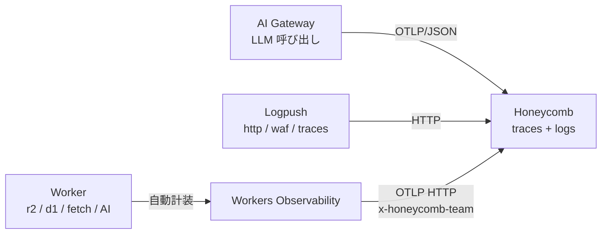

# Observability

<!--
Cloudflare で AI スタックを「見る + 統制する」 2 軸を 1 章で扱う。
- 観測 (telemetry): Workers Obs / Logpush + Log Explorer / AI Gateway / Analytics Engine の 4 source
- 統制 (governance): AI Gateway (LLM 層) + MCP Server Portal (ツール層) の 2 portal
- 集約: OTel で外に出して Honeycomb に束ねる → 脱ベンダーロックイン

LLM 呼び出しとツール呼び出しが社内に散らばる sprawl 問題に対し、Cloudflare は
LLM 層を AI Gateway、ツール層を MCP Server Portal で集約・統制する 2 つの portal を
提供する。観測と統制を同じ章で扱うことで「見るために統制する / 統制するために見る」
の循環を 1 つのストーリーで通せる。
-->

---

# Workers Logs

Worker が出すログ (`workers_trace_events`) を、用途で 4 経路に振り分けます。

- **Workers Logs**: ダッシュボードに自動収集（保持 7 日）→ 普段使いのログ閲覧
- **Real-time Logs**: near real-time の live tail（保存はされない）→ デプロイ直後の動作確認
- **Tail Workers**: 別 Worker でログを受けて filtering / sampling / 変換 / export → カスタム加工・別宛先転送
- **Workers Logpush**: 外部 destination に数分バッチで push（R2 / Pipelines / 汎用 HTTP / SIEM）→ 既存 SIEM / DWH 連携・長期保管

→ **Invocation logs / Custom logs / Errors / Uncaught exceptions** が共通の元データ。`console.log` を JSON object にすると自動でフィールド抽出。

→ Workers Observability の Destinations から **OpenTelemetry 互換**でエクスポート可能。

<!--
4 経路の選択指針:
- ダッシュボードで普通に見たい → Workers Logs (GA、保持 7 日、JSON 自動抽出)
- 今この瞬間を見たい → Real-time Logs (sampling mode に注意)
- 自前ロジックで加工 / 別宛先に転送 → Tail Workers (Beta)
- 既存 SIEM / DWH に長期 push → Workers Logpush (R2 / S3 / GCS / Datadog / Splunk / Pipelines / 汎用 HTTP)

共通の元データは workers_trace_events (1 invocation あたり最大 256 KB)。
console.log() / 例外 / リクエスト metadata / ヘッダ が自動キャプチャ。
JSON object を渡すとフィールド自動抽出 + unlimited cardinality。
-->

---

# Workers Metrics & Analytics

dashboard と API で **何が / どれくらい / どう動いたか** を測れます。

- **Built-in メトリクス**: Requests / Subrequests / Wall Time / CPU Time / Execution Duration（保持 3 ヶ月）→ Worker の基本健康状態を把握
- **GraphQL Analytics API**: 1 endpoint で Workers / KV / D1 / Workflows などを横断クエリ → 複数プロダクト集計・カスタムダッシュボード
- **Workers Analytics Engine**: アプリ独自の高カーディナリティ時系列（保持 90 日、ClickHouse-like な columnar store）→ 業務メトリクス・per-user / per-tenant 計測

→ Worker から **OpenTelemetry SDK で custom metrics を push** も可能（built-in は GraphQL / SQL API 経由）。

<!--
Built-in メトリクスは Workers Paid プラン込みで追加課金なし。
Subrequests は fetch から発した 2nd hop 通信、外部 API 依存の重さを見るのに使える。
Invocation Statuses は Success / Client Disconnected / Worker Threw Exception /
Exceeded Resources / Internal Error の 5 区分。

GraphQL Analytics API endpoint は dashboard の裏側でも使われている本物の API。
プロダクト別 dataset (workersInvocationsAdaptive / kvOperationsAdaptiveGroups /
kvStorageAdaptiveGroups / d1AnalyticsAdaptiveGroups / d1StorageAdaptiveGroups /
d1QueriesAdaptiveGroups / workflowsAdaptiveGroups) で横断クエリできる。

Analytics Engine は OTel 経路に乗らないが、無制限カーディナリティで業務メトリクスを
手軽に貯められる。blobs (文字列 最大 20) / doubles (数値 最大 20) / indexes
(サンプリングキー) の 3 種類。Workers Paid 無料枠あり、保持 90 日。
-->

---

# Workers Traces

`observability.tracing.enabled = true` の **1 行で自動 span 化**（OpenTelemetry 互換）。

- **自動 span**: Fetch / Binding (KV / R2 / DO) / Handler (`fetch` / `scheduled` / `queue`)
- **共通属性**: `cloud.*` / `faas.*` / `service.name` / `cloudflare.*` / `telemetry.sdk.*`
- **OpenTelemetry 互換バックエンドに直送**（OTLP HTTP）、`head_sampling_rate` 0〜1 でコスト調整

→ **使い時**: ボトルネック特定 / 外部依存のレイテンシ可視化 / リクエスト全体のライフサイクル追跡

→ **制約 (beta)**: 非 I/O は `0ms` / 外部 trace context 非伝播 / Service Binding と DO は別 trace

<!--
2025-11-07 に open beta 開始。「自動計装で 1 行 enable」は観測世界で強烈に効く。
従来は OpenTelemetry SDK を入れて span 化を自前で書く必要があった。
fetch / binding / handler が共通形で span 化されるので、Worker → R2 / D1 → 外部 API の
全体トレースが何もせずに取れる。

head_sampling_rate のデフォルトは 1 (全部取る)。本番では 0.05 (5%) など下げて
コストを抑えるのが定番。logs と traces で別々に sampling rate を設定可能。

エクスポート対応: OTLP endpoint があれば任意のバックエンド (Honeycomb / Grafana Cloud /
Sentry / Axiom 等)。dashboard → Workers & Pages → Observability → Destinations で設定。

既知の制約 (beta):
- Worker の Spectre 対策 (timer 粒度制限) で非 I/O 操作の経過時間が 0ms に丸まる
- W3C Trace Context での外部伝播がまだ → 外部サービスとの trace が繋がらない (改善予定)
- Service Binding や Durable Object をまたぐ呼び出しは別 trace (改善予定)
- span 名 / 属性名は beta 中に変わる可能性

課金: 2026-03-01 から開始予定。Workers logs と共有クォータで Free 200K events/日、
Paid 10M/月込み。料金は最新を要確認。
-->

---
layout: two-cols-header
---

# AI Gateway

**Universal Endpoint** で全 LLM プロバイダーを 1 経路に集約。**Fallback / Retry** 込みで以下の 3 カテゴリ・11 機能を一括導入できます。

::left::

<div class="text-xs">

- **Performance & Cost**: Caching / Rate Limiting / Dynamic Routing / Custom Costs → コスト・レイテンシを下げたい
- **Security & Safety**: Guardrails / DLP / Authentication / BYOK → 機密情報・有害コンテンツを構造で防ぎたい
- **Observability & Analytics**: Analytics / Logging / Custom Metadata → 部署 / ユーザー別の使用状況を可視化したい

</div>

→ Gateway 経由を強制すれば、観測 / 統制 / コスト管理を後付けで実装する必要がなくなります。AI Sprawl の解決策の一つに。

::right::


<!--
AI Gateway は LLM 呼び出しの reverse proxy。Universal Endpoint で全プロバイダー
(OpenAI / Anthropic / Workers AI / Google Vertex / DeepSeek / Azure OpenAI /
Perplexity 等 20+) を 1 URL に集約する。本文には他社名を出さず「全 LLM
プロバイダー」の表現に留める。

基盤メカニズム (intro 行に集約):
- Universal Endpoint: 全 provider を 1 URL でルーティング
- Fallback: provider / model 障害時の自動切替 (cf-aig-step で経路追跡)
- Retry: タイムアウト / 失敗時の再試行ポリシー

公式 Features ページに従って 3 カテゴリ・11 機能:

(1) Performance & Cost Optimization
- Caching: 意味的に同じリクエストをキャッシュしてレイテンシ最大 90% 削減 + コスト削減
- Rate Limiting: 時間枠ごとのリクエスト上限。API クォータ枯渇を構造で防止
- Dynamic Routing: ユーザーセグメント / 地理 / コンテンツ分析でリクエストを
  ルーティング。A/B テストやリージョナル振り分けが宣言的に書ける
- Custom Costs: 交渉済みレートやカスタムコストモデルで集計上の料金を上書き、
  正確な部署別 / 顧客別の課金ロジックが組める

(2) Security & Safety
- Guardrails: プロンプトと応答の有害コンテンツをリアルタイム検出 / ブロック。
  Hallucination / プロンプトインジェクション / 不適切発言の対策
- DLP: PII / 財務データなどの機密情報をパターンマッチで FLAG / BLOCK。
  GDPR / HIPAA 等のコンプライアンス文脈で使う
- Authentication: Gateway 自体へのトークンベースアクセス制御
- BYOK: provider API キーを Cloudflare の暗号化インフラで集中管理。アプリ側の
  secrets に API キーを置かなくて済む (Workers Secrets と二重で守れる)

(3) Observability & Analytics
- Analytics: リクエスト数 / トークン / コスト / エラーをダッシュボードで集計
- Logging: 全リクエスト / レスポンスの詳細ログ。デバッグ / 監査 / 分析に
- Custom Metadata: cf-aig-metadata ヘッダで user_id / team / version 等を付与、
  「どの部署のどのユーザーが何モデルをいくら使ったか」を後追いできる

BYOK + Custom Costs + Guardrails の 3 つは特に効くポイント。Guardrails (有害
コンテンツ検出) は DLP (機密情報) と並ぶ統制の柱として強調できる。
-->

---

## AI Gateway も OTel — LLM スパンが同じトレースに繋がる

AI Gateway 経由の **全 LLM 呼び出し**を **Gen AI セマンティック規約**準拠の span として OTLP エクスポートできます。Workers Observability と組み合わせると、Worker → Gateway → LLM が **1 つのトレース**に束ねられます。

### 自動付与される span 属性

- `gen_ai.request.model` / `gen_ai.model.provider`
- `gen_ai.usage.input_tokens` / `output_tokens`
- `gen_ai.prompt_json` / `gen_ai.completion_json`
- `cf-aig-metadata` ヘッダの値 (team / user 等)

### Trace Context 伝播

Worker から `cf-aig-otel-trace-id` / `cf-aig-otel-parent-span-id` を渡せば、**Worker のトレースに LLM 呼び出しが直接ぶら下がります**。レイテンシ / コスト / モデル別使用量を **Worker のスパンと同じ画面で相関**できます。

**設定**: AI Gateway ダッシュボード → Settings → OTel exporter で OTLP/JSON エンドポイントと認可ヘッダを登録（Honeycomb など OTLP/JSON 対応バックエンド）

<!--
AI Gateway は独自の OTLP エクスポート機能を持っていて、Gen AI セマンティック
規約に準拠した span を吐ける。属性としては gen_ai.request.model でモデル名、
gen_ai.usage に input_tokens / output_tokens、それからプロンプト本文と
レスポンス本文も span に乗る (秘匿したい場合は別途設定で除外可能)。
重要なのが trace context 伝播で、Worker 側で cf-aig-otel-trace-id ヘッダを
渡せば、AI Gateway 側の LLM 呼び出しが Worker のトレースに 1 階層下のスパン
としてぶら下がる。これでリクエスト全体のレイテンシ、トークンコスト、モデル別
使用量を、Worker のログと同じバックエンドで相関分析できる。
設定は AI Gateway ダッシュボードの Settings タブから OTel exporter を追加するだけ。
ただし AI Gateway 側は OTLP/JSON のみで protobuf 形式は非対応なので、
バックエンド選定の際はそこだけ注意。
-->

---

# MCP Server Portal

組織内で乱立する MCP server (= LLM が叩く外部ツール群) を **中央集約してアクセス制御** する portal。**Cloudflare Access** が認証 / 認可 / 監査を担当します。

- **集約 / 認証**: 1 portal URL に複数 MCP server / OAuth 2.0 / SSO・MFA
- **3 軸ポリシー**: Identity × Conditions × Scope
- **Code Mode**: tool 定義を 1 つに圧縮 → context window 削減
- **監査ログ**: Access logs → SIEM / Logpush

<div class="grid grid-cols-2 gap-4 mt-4">


</div>

→ **使い時**: Shadow MCP の防止 / 部署別の tool アクセス制御 / IDE エージェントの破壊操作の構造的封じ込め

→ AI Gateway と合わせて「LLM 層 + ツール層」の二重統制が成立します。

<!--
MCP server portal は Cloudflare Access の AI controls 配下に提供されている機能で、
組織内の MCP server を中央管理するための portal。Shadow MCP (社員が勝手にローカル
で MCP server を立てて社内 DB / Notion / GitHub 等に繋ぐ) を、Access 経由の
gateway を強制することで構造的に止める設計。

(1) 集約: 内部 (self-hosted)、SaaS (Access for SaaS 経由)、サードパーティ
(OAuth 連携) の 3 種類の MCP server を 1 つの portal URL に束ねられる。MCP
クライアント (LLM 側) は portal URL 1 つだけ知っていればよい。

(2) 認証: OAuth 2.0 の authorization code flow (managed OAuth) で MCP クライアントを
認証。非ブラウザクライアントには 401 + WWW-Authenticate ヘッダで Access の OAuth
discovery エンドポイントを案内する仕様。

(3) ポリシー: Access の標準ポリシーが効くので、Identity / Conditions / Scope の
3 軸で粒度の細かい制御が可能。「特定 tool だけ許可」「device posture が OK
なときのみ許可」など。

(4) Code Mode: portal の機能で、複数 MCP server の全 tool 定義を 1 つの code tool に
畳み込み、LLM の context window 使用量を抑える。tool 定義が肥大化したときの
解。code path を経由する以上、AI Gateway との二重ゲートが取れる。

(5) 監査: Access logs に「どのユーザーがどの tool をいつ実行したか」が記録される。
Logpush で R2 / Iceberg / Honeycomb に流せば、AI Gateway logs と組み合わせて
LLM 層 + ツール層の Correlated audit が成立する。

事故シナリオ (IDE エージェントが本番 DB を DROP) → 対処は MCP Portal で破壊的
tool を Scope から外す + AI Gateway で DLP に「DROP TABLE 等の SQL パターン」を
ブロックリストに追加 + Workflows の waitForEvent で人間承認を挟む、の組合せで
構造的に発生不能にできる。
-->

---

# OTLP で Honeycomb へ送る

Workers Observability / AI Gateway は **OTLP HTTP** で外部バックエンドにそのまま送れます。Logpush は HTTP destination で Honeycomb の Logpush integration に直送できます。



- **Honeycomb** は OpenTelemetry リファレンスバックエンド
- Workers Observability の **公式サポート対象** (Grafana / Honeycomb / Sentry / Axiom)
- API キー 1 個で完結 (`x-honeycomb-team` ヘッダ)
- dataset は OTLP の `service.name` 属性で**自動分離**

```
OTLP Endpoint: https://api.honeycomb.io/v1/traces
Custom Header: x-honeycomb-team: <HONEYCOMB_API_KEY>
```

<!--
4 つの source のうち 3 つ (Workers Obs / AI Gateway / Logpush) は Honeycomb
に集約できる。Workers Obs と AI Gateway は OTLP HTTP で直接、Logpush は
Honeycomb の Logpush 受け口に HTTP で送る。
Analytics Engine だけは OTel ではなく Cloudflare 内 SQL API なので、
Honeycomb に直送する標準機能は無い。SQL でクエリした結果を別途取り込む形に
なる (アプリ独自の業務メトリクスは Cloudflare 内で完結させる方が自然な選択)。
Honeycomb は OpenTelemetry プロジェクトの主要貢献者で "observability" 概念の
伝道元、OTel-native 設計が一番自然に刺さる。Cloudflare の公式サポート対象
バックエンドの一つでドキュメントも揃っている。
設定は API キー 1 個を x-honeycomb-team ヘッダに入れるだけ。dataset (Honeycomb
内の論理区切り) は OTLP の service.name で自動分離されるので、他の宛先と比べて
最も簡素。
全部 OTel 標準で送るので、Honeycomb から Grafana / Datadog / Sentry に乗り換える
時も destinations 設定を差し替えるだけで済む = ベンダーロックインを構造で回避
できる、というのがこの構成の根本的な価値。
-->
