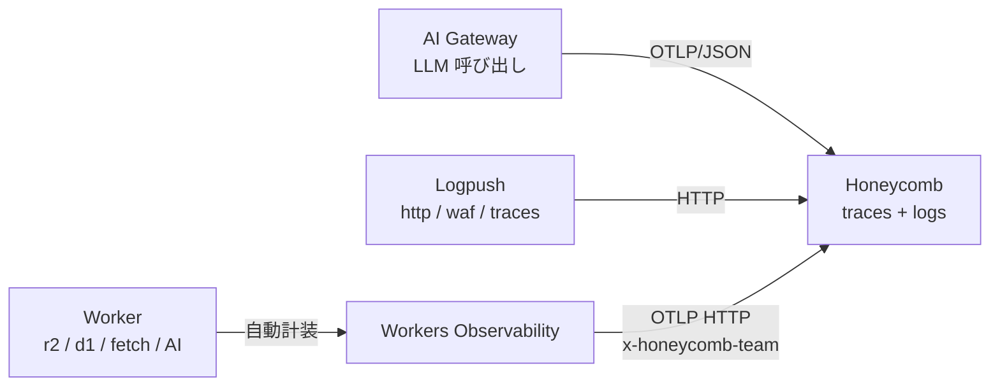

# Observability

<!--
Cloudflare には telemetry source が 4 つある: Workers Observability (Worker 内
trace の自動計装)、Logpush (Cloudflare 製品が生成するログ)、AI Gateway (LLM
呼び出し span)、Analytics Engine (Worker から書く高カーディナリティ時系列)。
これらを OTLP / HTTP で Honeycomb に集約することで、ベンダーロックインなく
一元観測できる。本セクションでは 4 つの source を紹介してから、Honeycomb への
集約パスを見せる構成。
-->

---

# Workers Observability

全ての操作に**自動でスパンが生成**(OpenTelemetry 互換)。

- R2 読み書き / D1 クエリ / 外部 fetch / Queue 送信 / AI 推論を**自動計装**
- コード変更なしでパイプラインのボトルネックを可視化
- `observability.traces.enabled = true` の **1 行で有効化**

```jsonc
// wrangler.jsonc
{
  "observability": {
    "traces": { "enabled": true, "head_sampling_rate": 0.05 },
    "logs":   { "enabled": true }
  }
}
```

<!--
Workers Observability は Cloudflare 純正のテレメトリ基盤。R2 / D1 / fetch /
Queue / Workers AI など Worker 内の主要な操作が全部自動でスパン化される。
SDK 導入や計装コードは不要、wrangler.jsonc に enabled: true を書くだけ。
本番では head_sampling_rate: 0.05 で 5% に絞ってコストを抑えつつ代表的な
トレースが取れる、という運用がベース。
-->

---

# Logpush + Log Explorer

Cloudflare 製品が生成する **HTTP リクエスト / WAF / Workers traces / DNS** などのログ。**外に push する (Logpush) / 中でクエリする (Log Explorer)** の 2 つの取り回しを選べる。共通 datasets。

<div class="grid grid-cols-2 gap-4 mt-4 text-sm">

<div class="border border-orange-500/30 rounded p-3">

### Logpush — 外に push

宛先: **R2 / S3 / GCS / Datadog / Splunk / Pipelines / 汎用 HTTP**

- フィルタ / フィールド選択 / サンプリング率
- バッチ間隔は数分
- 既存の SIEM / DWH / Iceberg に集約したい用途

</div>

<div class="border border-orange-500/30 rounded p-3">

### Log Explorer — 中でクエリ

Cloudflare ダッシュボード or **SQL API** で同じ datasets を直接クエリ。データは R2 上に per-customer 格納。

- カスタムダッシュボード / 保存クエリ
- 契約で最大 **2 年保持** に拡張可能
- 即時 forensics / 監査で外部転送を挟みたくない用途

</div>

</div>

<div class="mt-4 text-sm op-80">

datasets (両者共通): `http_requests` / `firewall_events` / `workers_trace_events` / `dns_logs` / `access_requests` ほか

</div>

<!--
Cloudflare の製品が生成するログを扱うレイヤー。同じ source データに対して
2 つの取り回しがある。

(1) Logpush は「外に push」: 数分間隔のバッチで R2 / S3 / GCS / Datadog /
Splunk / Pipelines / 汎用 HTTP に流す。Pipelines を destination にすると
Stream → Pipeline → Sink が自動で組まれて R2 (Iceberg / Parquet / JSON) に
着地する (前章の Pipelines と再合流するポイント)。フィルタ・フィールド選択・
サンプリング率でボリューム制御可能。リアルタイム観測には不向き、バッチ寄り。

(2) Log Explorer は「中でクエリ」: Cloudflare ダッシュボードか SQL API で
直接クエリする。データは Cloudflare の R2 に per-customer で格納される。
カスタムダッシュボード、保存クエリ、自然言語チャート定義 (response time /
error rate / top statistics) などがある。標準保持はデフォルト期間、Contract
顧客は最大 2 年保持 ($0.10/GB/月、料金は変動するので最新は要確認) を選べる。
2025 年 6 月 GA。

datasets は両方で共通: http_requests (アクセスログ)、firewall_events (WAF)、
workers_trace_events (Worker の生 console.log + 例外)、dns_logs、access_requests
(Zero Trust Access) など。Account 単位 / Zone 単位で対応 datasets が分かれる。

「外に出す or 中で見る」は排他ではなく、両方有効化して併用も可能。例えば本番
インシデントの初動は Log Explorer で即時クエリ、長期保管 / SIEM 連携は Logpush
で R2 / Datadog に流す、というハイブリッド運用が実務的。
-->

---

# AI Gateway も OTel — LLM スパンが同じトレースに繋がる

AI Gateway 経由の **全 LLM 呼び出し**が **Gen AI セマンティック規約**準拠の span として OTLP エクスポート可能。Workers Observability と組み合わせると、Worker → Gateway → LLM が **1 つのトレース**に束ねられる。

<div class="grid grid-cols-2 gap-4 mt-4 text-sm">

<div class="border border-orange-500/30 rounded p-3">

### 自動付与される span 属性

- `gen_ai.request.model` / `gen_ai.model.provider`
- `gen_ai.usage.input_tokens` / `output_tokens`
- `gen_ai.prompt_json` / `gen_ai.completion_json`
- `cf-aig-metadata` ヘッダの値 (team / user 等)

</div>

<div class="border border-orange-500/30 rounded p-3">

### Trace Context 伝播

Worker から `cf-aig-otel-trace-id` / `cf-aig-otel-parent-span-id` を渡せば、**Worker のトレースに LLM 呼び出しが直接ぶら下がる**

→ レイテンシ / コスト / モデル別使用量を **Worker のスパンと同じ画面で相関**

</div>

</div>

<div class="mt-4 border border-orange-500/30 rounded p-3 text-sm">

**設定**: AI Gateway ダッシュボード → Settings → OTel exporter で OTLP/JSON エンドポイントと認可ヘッダを登録 (Honeycomb など OTLP/JSON 対応バックエンド)

</div>

<!--
AI Gateway は独自の OTLP エクスポート機能を持っていて、Gen AI セマンティック
規約に準拠した span を吐ける。属性としては gen_ai.request.model でモデル名、
gen_ai.usage に input_tokens / output_tokens、それからプロンプト本文と
レスポンス本文も span に乗る (秘匿したい場合は別途設定で除外可能)。
重要なのが trace context 伝播で、Worker 側で cf-aig-otel-trace-id ヘッダを
渡せば、AI Gateway 側の LLM 呼び出しが Worker のトレースに 1 階層下のスパン
としてぶら下がる。これでリクエスト全体のレイテンシ、トークンコスト、モデル別
使用量を、Worker のログと同じバックエンドで相関分析できる。
設定は AI Gateway ダッシュボードの Settings タブから OTel exporter を追加するだけ。
ただし AI Gateway 側は OTLP/JSON のみで protobuf 形式は非対応なので、
バックエンド選定の際はそこだけ注意。
-->

---

# Analytics Engine — Worker から書く高カーディナリティ時系列

Worker から `env.X.writeDataPoint()` でカスタムイベントを時系列で記録。**user_id / tenant** などの高カーディナリティ属性を保持できる柱状型ストア。

```typescript
env.ANALYTICS.writeDataPoint({
  blobs:   [path, country, tenant],   // 文字列ディメンション (最大 20)
  doubles: [duration_ms],              // 数値メトリクス (最大 20)
  indexes: [user_id],                  // サンプリングキー
});
```

- 非同期書き込み (`await` 不要、レイテンシに影響しない)
- 保持 **90 日**、SQL API でクエリ可能
- 用途: 業務メトリクス / 課金集計 / SLI 計測 / per-tenant 観測

<!--
Analytics Engine は Workers Analytics Engine とも呼ばれる、Worker 専用の
時系列カスタムイベントストア。env.X.writeDataPoint() で書き込み、SQL API で
クエリする。データポイントは blobs (文字列ディメンション 最大 20)、doubles
(数値 最大 20)、indexes (サンプリングキー 1 つ、最大 96 byte) の 3 種類で
構成される。
最大の特徴は「無制限カーディナリティ」: user_id や tenant のようなキー数が
無限に増えるディメンションでも問題なく扱える (内部的には weighted adaptive
sampling で書き込み・クエリの両方をスケールさせる仕組み)。
保持は 90 日、Workers Paid で 10M data points / 月 + 1M クエリ / 月が含まれる
(超過時は data points $0.25/M、クエリ $1.00/M)。料金は変動するので最新は要確認。
Cloudflare 内で観測を完結したい時の選択肢。OTel ではないので Honeycomb への
直接エクスポートは無く、SQL API 経由で必要に応じて他システムに転送する形。
-->

---

# OTLP で Honeycomb へ送る

Workers Observability / AI Gateway は **OTLP HTTP** で外部バックエンドにそのまま送れる。Logpush は HTTP destination で Honeycomb の Logpush integration に直送できる。



- **Honeycomb** は OpenTelemetry リファレンスバックエンド
- Workers Observability の **Day 1 サポート対象** (Grafana / Honeycomb / Sentry / Axiom)
- API キー 1 個で完結 (`x-honeycomb-team` ヘッダ)
- dataset は OTLP の `service.name` 属性で**自動分離**

<div class="text-sm op-80 mt-3">

```
OTLP Endpoint: https://api.honeycomb.io/v1/traces
Custom Header: x-honeycomb-team: <HONEYCOMB_API_KEY>
```

</div>

<!--
4 つの source のうち 3 つ (Workers Obs / AI Gateway / Logpush) は Honeycomb
に集約できる。Workers Obs と AI Gateway は OTLP HTTP で直接、Logpush は
Honeycomb の Logpush 受け口に HTTP で送る。
Analytics Engine だけは OTel ではなく Cloudflare 内 SQL API なので、
Honeycomb に直送する標準機能は無い。SQL でクエリした結果を別途取り込む形に
なる (アプリ独自の業務メトリクスは Cloudflare 内で完結させる方が自然な選択)。
Honeycomb は OpenTelemetry プロジェクトの主要貢献者で "observability" 概念の
伝道元、OTel-native 設計が一番自然に刺さる。Cloudflare 公式の Day 1 サポート
対象なのでドキュメントも揃っている。
設定は API キー 1 個を x-honeycomb-team ヘッダに入れるだけ。dataset (Honeycomb
内の論理区切り) は OTLP の service.name で自動分離されるので、他の宛先と比べて
最も簡素。
全部 OTel 標準で送るので、Honeycomb から Grafana / Datadog / Sentry に乗り換える
時も destinations 設定を差し替えるだけで済む = ベンダーロックインを構造で回避
できる、というのがこの構成の根本的な価値。
-->
