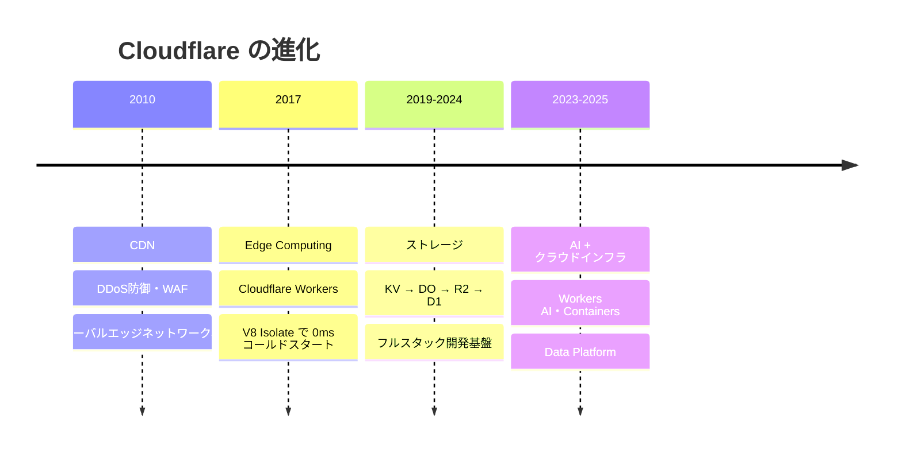

# Cloudflare とは

---

# Cloudflare の概要

<v-clicks>

- 2010年創業。CDN・DDoS 防御・WAF からスタート
- 現在は **330+ 都市のエッジネットワーク**を持つグローバルクラウドプラットフォーム
- 2025年通期の年間収益 $2.17B（前年比 +30%）
- Fortune 500 の 38% が顧客、日本では **ISMAP** 取得済み

</v-clicks>

「リージョンは Earth」

デプロイした瞬間に全 330+ 拠点で動く。リージョン設計不要。

---

# Cloudflare の進化 — 3つの世代

<v-click>

**キーメッセージ**: Cloudflare は「CDN 企業」でも「エッジコンピューティング企業」でもない。
**クラウドインフラ・Data Platform・AI を一体で提供するグローバルなサーバーレスプラットフォーム**。

</v-click>
