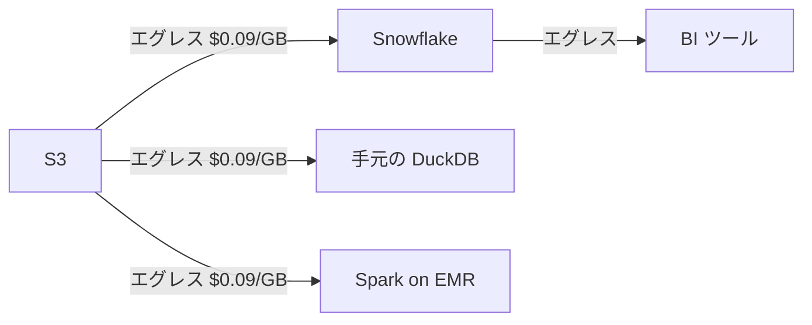

# Part 1

## あなたのエグレス料金、いくら？

---

# データエンジニアの日常

100GB のデータを手元の DuckDB で分析したい

→ S3 エグレス: **$9**（毎回）

→ 毎日やったら月 **$270**（データ見るだけで）

---

# エグレス料金の不条理

| やりたいこと | AWS のコスト |
|---|---|
| S3 のデータを Athena でクエリ | スキャン料 + エグレス |
| S3 → Snowflake にロード | エグレス |
| S3 → 手元の DuckDB で分析 | エグレス |
| S3 → 別リージョンにコピー | **リージョン間転送料** |
| S3 のデータを誰かに共有 | エグレス |

> データを**置くのは安い**、**出すのが高い**
>
> → これが **Cloud の罠** であり **ロックイン** の本質

---

# もしエグレスが $0 だったら？

<v-clicks>

- 手元の DuckDB から気軽にクエリできる
- Snowflake からも Spark からも同じデータを読める
- データ共有に課金を気にしなくていい
- **クエリエンジンを自由に選べる**

</v-clicks>

<v-click>

それが **R2**

</v-click>
