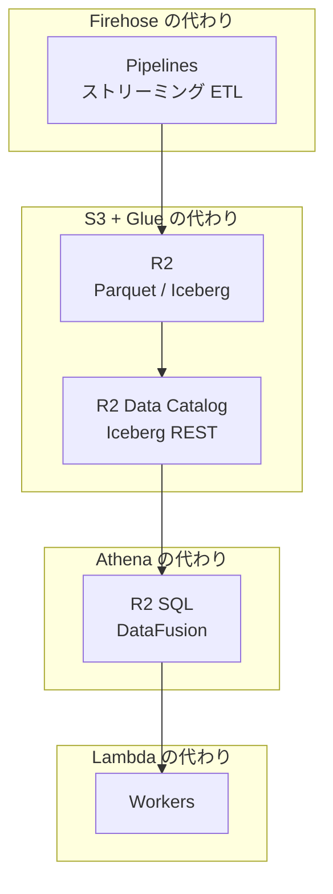

# Part 2

## Cloudflare Data Platform とは

---

# 3行で説明すると

<v-clicks>

1. **R2** = エグレス $0 の S3（Iceberg 対応）
2. **Pipelines** = Kafka + Flink が要らないストリーミング ETL
3. **R2 SQL** = Athena 相当（ただし JOIN がない）

</v-clicks>

<v-click>

 

> 2025年9月発表。全部 **Beta** で **無料**。
> 本番稼働は Workers Paid **$5/月** だけ。

</v-click>

---

# データエンジニアが知ってる言葉で

| Cloudflare | あなたが知ってるやつ |
|---|---|
| R2 | S3（エグレス $0 版） |
| R2 Data Catalog | AWS Glue / S3 Tables |
| Pipelines | Kinesis Firehose + Flink |
| R2 SQL | Athena（機能は1/3くらい） |
| D1 | RDS for SQLite |
| KV | DynamoDB（読取特化） |
| Workers | Lambda（コールドスタート 0ms） |
| Containers | Fargate（Beta） |
| Workflows | Step Functions（TypeScript版） |

---

# アーキテクチャ（AWS脳で読む版）

