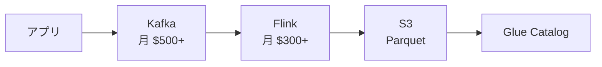
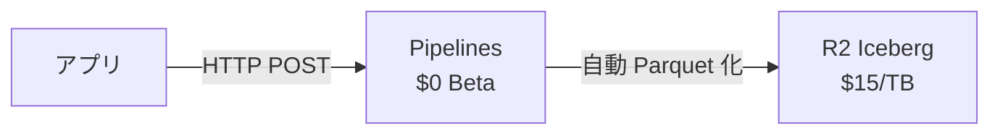

# Part 4

## Pipelines — Kafka 要らなくない？

---

# あなたのストリーミング基盤



- Kafka クラスタの運用
- Flink ジョブの監視
- スキーマレジストリの管理
- Parquet の最適化
- **月 $800+、運用工数は別**

---

# Pipelines なら

```bash
# これだけ
wrangler pipelines create my-pipeline --r2-bucket data-lake
```



- Kafka 不要
- Flink 不要
- スキーマレジストリ → Pipeline の JSON スキーマ
- Parquet 最適化 → 自動
- **$0（Beta 中）**

---

# Pipelines — SQL で変換

```sql
-- 取り込み時にフィルタ + マスキング + 型変換
SELECT
  id,
  REGEXP_REPLACE(email, '(.{2}).*@', '$1***@') AS email,
  event_type,
  CAST(amount AS DOUBLE) AS amount
FROM stream
WHERE event_type != 'debug'
  AND environment = 'production'
```

Firehose だと Lambda を書く必要があったやつが **SQL 1つ**

---

# Pipelines の正直な評価

### 勝ってるところ

- SQL ベースの宣言的変換（Lambda 不要）
- Exactly-once 配信保証
- Arroyo ベース（Rust 製、高性能）
- **$0**（Beta 中）

### 負けてるところ

| 機能 | Firehose / Flink | Pipelines |
|---|---|---|
| 配信先 | S3, Redshift, OpenSearch, HTTP... | **R2 のみ** |
| ステートフル処理 | ✅（ウィンドウ集約、JOIN） | **❌** |
| 入力ソース | Kinesis, MSK, Direct PUT... | **HTTP + Worker のみ** |
| GA + SLA | ✅ | **❌ Beta** |

> 配信先が R2 のみ。D1 にも書けない。出口が1つしかない
