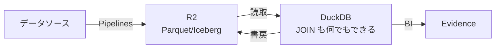
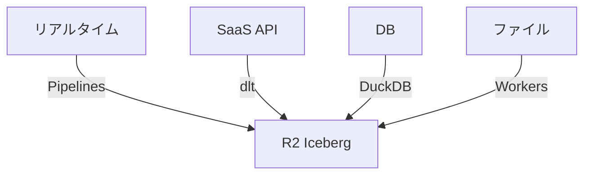

# Part 6

## じゃあ実際どう組むのか

---

# 現実的な構成: DuckDB が主役



- **R2**: データの置き場（エグレス $0）
- **Pipelines**: ストリーミング取り込み
- **DuckDB**: 変換 + クエリ（フル SQL）
- **R2 SQL**: 単純な集計だけ

> R2 SQL の完成を待つ必要はない。**DuckDB で今すぐ使える**

---

# dbt + DuckDB + R2

```bash
# GitHub Actions で dbt を実行
uvx --with dbt-duckdb dbt run
```

```yaml
# dbt の profiles.yml
my_project:
  target: dev
  outputs:
    dev:
      type: duckdb
      path: ':memory:'
      extensions:
        - httpfs
        - parquet
      settings:
        s3_endpoint: '<account-id>.r2.cloudflarestorage.com'
```

- R2 の Parquet を直接読み書き
- JOIN, WINDOW, CTE — なんでもできる
- GitHub Actions なら追加コスト $0

---

# 4つの取り込みパターン

| データの種類 | 方法 | 例 |
|---|---|---|
| リアルタイムイベント | **Pipelines** | ログ、クリックストリーム |
| SaaS API | **dlt + Sandbox** | Stripe, GitHub, Salesforce |
| DB レプリケーション | **DuckDB + Sandbox** | PostgreSQL → Parquet |
| ファイルアップロード | **Workers + Queues** | CSV, Excel |



---

# dlt — Fivetran キラー

```python
import dlt

pipeline = dlt.pipeline(
    pipeline_name='stripe',
    destination='filesystem',  # → R2
    dataset_name='stripe'
)

# Stripe API → R2 Parquet（これだけ）
pipeline.run(stripe_source())
```

- **100+ のデータソース**に対応
- Sandbox 上で Cron 実行
- Fivetran 的なことが **$0** でできる
- スキーマ自動検出、インクリメンタルロード

---

# 配信: Evidence — Code as BI

```markdown
# 月次売上レポート

\`\`\`sql revenue
SELECT
  date_trunc('month', ordered_at) as month,
  SUM(amount) as revenue
FROM orders
GROUP BY 1
ORDER BY 1
\`\`\`

先月の売上は **<Value data={revenue} column=revenue />** でした。

<BarChart data={revenue} x=month y=revenue />
```

- **SQL + Markdown** だけでダッシュボード
- Git 管理可能（PR レビュー → デプロイ）
- Workers Static Assets でホスティング → **$0**
- Zero Trust で認証 → 50ユーザーまで無料

---

# DuckDB WASM — ブラウザで分析

実行ボタンで動かせます:

```ts {monaco-run}
// ブラウザ内で DuckDB 的なクエリを体験
const data = [
  { event: 'page_view', count: 1234, cost_s3: 1234 * 0.09, cost_r2: 0 },
  { event: 'click', count: 567, cost_s3: 567 * 0.09, cost_r2: 0 },
  { event: 'purchase', count: 89, cost_s3: 89 * 0.09, cost_r2: 0 },
]

const total_s3 = data.reduce((s, d) => s + d.cost_s3, 0)
const total_r2 = data.reduce((s, d) => s + d.cost_r2, 0)

console.log(`S3 egress: $${total_s3.toFixed(2)} / R2 egress: $${total_r2}`)
console.log(`Savings: $${(total_s3 - total_r2).toFixed(2)}/month`)
```

- **サーバー不要**、ブラウザで完結
- HTTP Range Request で必要な部分だけ取得

> データエンジニアの社内ツールとして最強
