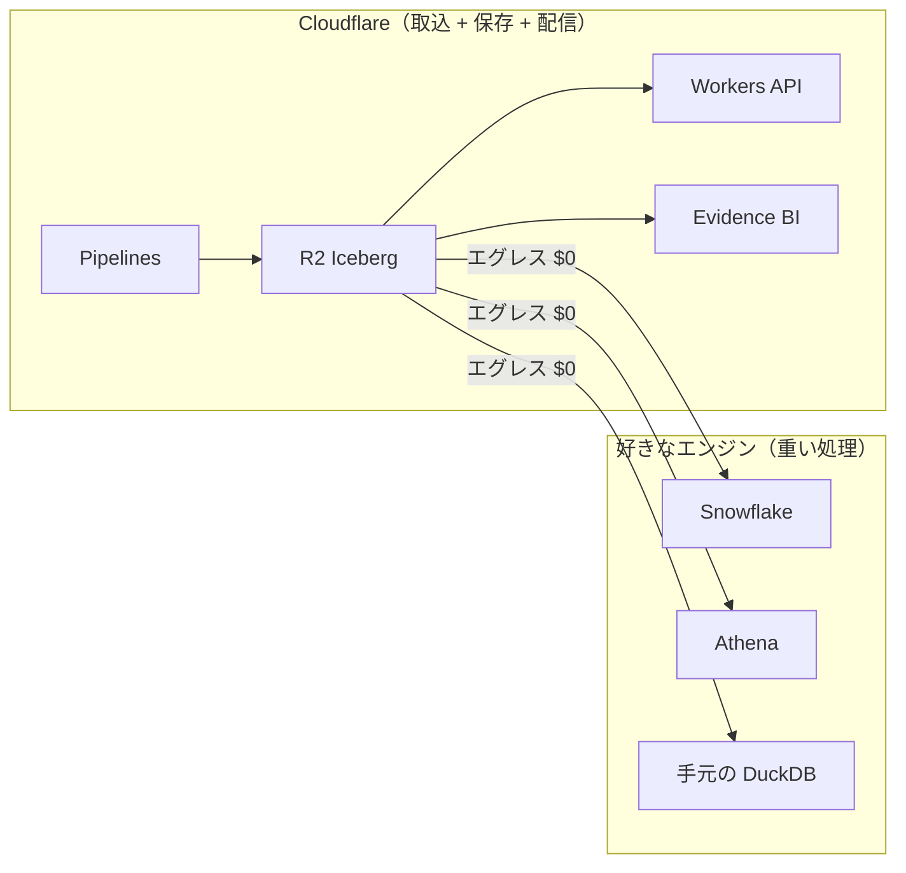

# Part 9

## Cloudflare vs AWS — 正直な評価

---

# どこで勝ってて、どこで負けてるか

| 対決 | 結果 |
|---|---|
| R2 vs S3 | 🟢 **勝ち**（エグレス$0、35%安い） |
| Workers vs Lambda | 🟢 **勝ち**（0ms起動、CPU課金） |
| Workflows vs Step Functions | 🟡 DXで勝ち、エコシステムで負け |
| Pipelines vs Firehose | 🟡 潜在力あり、配信先が R2 のみ |
| Queues vs SQS | 🟠 負け（FIFO なし、128KB制限） |
| R2 SQL vs Athena | 🔴 **大きく負け**（JOIN なし） |
| Containers vs Fargate | 🔴 **大きく負け**（Beta、K8s なし） |
| Workers AI vs Bedrock | 🔴 負け（モデル少、FT なし） |

---

# AWS に任せるべきもの

| これが必要なら | AWS を使え |
|---|---|
| JOIN + WINDOW + フル SQL | Athena / Redshift |
| 数TB のバッチ ETL | EMR / Glue |
| ML トレーニング | SageMaker |
| Kubernetes | EKS |
| IAM + Organizations + CloudTrail | AWS |

> R2 にデータを置いて、**コンピュートは AWS** でもいい。
> エグレス $0 だから、その構成が成り立つ。

---

# ハイブリッドが最適解

> **R2 をデータの重力の中心に据える。**
> クエリエンジンは用途で選ぶ。エグレス $0 がこの自由を生む。
